# Atlas v1 — design history

**Status:** deleted. Preserved at git tag `atlas-v1-v2-final` (commit `4d3351b6`). Every path below is cited as `path@atlas-v1-v2-final:Lstart-Lend`; read it with `git show atlas-v1-v2-final:<path>`, optionally `| sed -n 'Lstart,Lendp'`. Unqualified file names below (`pipeline.ts`, `claim-basis.ts`, …) all live under `src/lib/server/services/atlas/` unless stated otherwise.

**Audience:** whoever builds Atlas v4. v1 is the pipeline every later Atlas ADR (0037, 0038, 0040, 0052, 0053, 0062, 0063) is either fixing, migrating, or replacing — reading only v2's and v3's own history (`docs/atlas-history/v2.md`) without this document loses the *reason* several of v2/v3's guardrails exist, because those guardrails are literally "the opposite of what v1 did." Read the [lessons ledger](#9-lessons-ledger) (§9) even if you read nothing else; it is the section this document exists for.

---

## 1. Summary

Atlas v1 was the first of AlfyAI's three research-report content pipelines (v1 → v2 → v3), and the only one ever actually used by real users. It replaced a deleted "Deep Research" subsystem (16 tables, 7 model roles, a 60-second-tick worker, a plan-approval gate that "literally never worked reliably and always showed bullshit" — [ADR 0036](../adr/0036-atlas-is-normal-chat-turn-not-parallel-subsystem.md)) with a much smaller design: Atlas runs as a special kind of Normal Chat Turn whose kickoff message completes instantly, backed by a single in-process background worker that executes a fixed nine-stage pipeline (`decompose → search → curate → coverage-review → synthesize → integrate → assemble → audit → render`, `types.ts@atlas-v1-v2-final:347-357`) and writes one durable checkpoint after audit, before rendering.

**Dates live:** first shipped `d9342fed` (2026-06-19), continuously hardened through **2026-06-19 → 2026-06-27** (roughly 70 commits, mostly emergency fixes to make live output non-garbage — §9), then largely left alone while the SearXNG→Parallel migration (ADR 0052, 2026-07-13) and a module-boundary deepening pass (ADR 0053, 2026-07-14 → 2026-07-20) touched its search/rendering seams without changing its content architecture. It was **never used in production with real users at any real volume** in the sense of shipping many high-quality reports — see the prod numbers below — and was superseded as the selectable default by v2 on **2026-09-09** ([ADR 0062](../adr/0062-atlas-content-pipeline-is-rebuilt-on-the-harness-tools.md)), itself replaced by v3 the next day (2026-09-10, [ADR 0063](../adr/0063-atlas-v3-reasons-from-an-evidence-bank-not-from-search-excerpts.md)). It is deleted in the commit immediately following this document's creation.

**Why it was replaced** (ADR 0062's own words, `docs/adr/0062-...md:7-16`, quoting a 2026-09-08 staging run against the local model): the **job infrastructure worked** — 16 minutes, 28 sources, 185k input / 106k output tokens, HTML/PDF/Markdown all produced — but "the content was poor, in ways that are all pipeline-shaped rather than model-shaped": every paragraph carried the literal string `(Basis: Partial)`; **zero inline citations** tied any figure to a source; the source list contained a `301 Moved Permanently` stub, a LinkedIn company page, the same article three times through CDN/staging hostnames, and a stock image from a vendor blog; heading levels were inconsistent because roughly 1,600 lines of report-shape repair heuristics were reconstructing document structure out of free-form model Markdown. ADR 0062's root-cause sentence is the thesis of this whole document: **"v1 asks one model call to produce a whole well-formed report from a prose evidence brief, and then spends most of its code repairing that output."**

**All-time production numbers** (owner's ops query against the live `atlas_jobs` table, 2026-09-23, covering v1's entire deployed life — v2 never ran a real user job and v3 is out of scope for this document): **78 total jobs** (the owner's query counted 78 non-deleted rows; a separate 79-row count used for the source/lifecycle breakdowns below appears to include one job outside that filter), **~84% success rate**, **p50 wall time ≈ 4 minutes, p90 ≈ 11 minutes** (well under the archived live-attempt logs' 16–34 minute range — those logs are hand-run regression checks against the largest/most adversarial prompts, not a representative sample of ordinary usage). Failures split **10× `atlas_quality_gate_failed`** (the `AtlasPipelineQualityError` thrown when a structural critical audit marker survives — §6) and **2× `atlas_pipeline_failed`** (generic/unexpected errors). Only **3 of 79 jobs used local sources** (Atlas Local Sources from Knowledge/attachments — §10), and only **3 of 79 jobs were Continue/Revise/Fork** lifecycle actions rather than fresh `create` jobs — both numbers confirm v1 was used almost exclusively as "one-shot web research," never as an iterative document-building tool, despite the lifecycle-seed machinery (§3.9, §10) that was built for exactly that.

**Primary evidence besides the code itself:** `docs/archive/atlas-live-attempts/` (fifteen dated regression logs, `2026-06-22-attempt-001` through `2026-06-23-attempt-015`, each a full run against the live deployment with job/conversation ids, token/cost counts, and a manual quality verdict) and `docs/archive/atlas-live-baseline-2026-06-21.md` (the pre-hardening baseline). These are the closest thing v1 has to a controlled eval history, predating `scripts/atlas-eval.ts` (which was built for v2/v3) by over two months, and they are quoted extensively in §9.

---

## 2. End-to-end flow

```mermaid
flowchart TD
    Start(["worker-runner.ts claims job\n(pipeline_version 1 = the else branch,\nno v1-specific wrapper function)"]) --> Decompose

    Decompose["1. DECOMPOSE\nsynthesis model · text (not JSON) · thinking: unset\nmaxOutputTokens = profile flat cap (16k/24k/32k)"]
    Decompose --> BuildQ["buildAtlasSearchQueries:\nparse lines/JSON, drop prompt-echo,\nfallback to 3 templated queries,\napply freshness/year grounding"]
    BuildQ --> InitRound

    subgraph InitRound ["2. INITIAL RESEARCH ROUND"]
        direction TB
        Search["search stage\nParallel Search + Extract (§5)\nconverge: adult/dup/unusable/cap filters"] --> ImgSearch["image search (initial round only)\nBrave, time-range from freshness heuristic"]
        ImgSearch --> Curate["curate stage\nsynthesis model · text"]
        Curate --> EvPacks["buildAtlasEvidencePacks\n(deterministic, no model call)"]
        EvPacks --> Cov["coverage-review stage\nsynthesis model · strict JSON\n(schema-validated with zod)"]
    end
    Cov --> GapGate{"profile allows\nanother gap-fill round\nAND coverage review\napproved a gap?"}
    GapGate -->|yes, up to profile cap\noverview 0 / in-depth 1 / exhaustive 2| GapRound["gap-fill round\n(same search->curate->evidence->coverage\nshape, cross-round URL+material dedup)"]
    GapRound --> UsefulGate{"round added an accepted\nsource AND materially\nnew excerpt text?"}
    UsefulGate -->|no| Synth
    UsefulGate -->|yes| GapGate
    GapGate -->|no| Synth

    Synth["3. SYNTHESIZE\nsynthesis model · text"] --> Integrate["4. INTEGRATE\nsynthesis model · text\n-> sectionBriefs parsed from JSON if present"]
    Integrate --> Cards["build + TEI-rerank Writer Evidence Cards\n(deterministic build, then rerank routing\nwith deterministic fallback on rerank failure)"]
    Cards --> Writer

    subgraph Writer ["5. ASSEMBLE (the writer stage)"]
        direction TB
        W0["writer call\nsynthesis model · strict JSON\nmaxOutputTokens = SAME flat profile cap\nprompt truncation cascade: 6 tiers (0-5)"] --> Repair1{"needsAssemblyRepair?\n(process-only OR malformed-heading\nheuristics)"}
        Repair1 -->|yes| R1["repair pass 1: full context\n+ 'the previous draft was a process\nsummary, rewrite it' instruction"]
        Repair1 -->|no| Improve
        R1 --> Repair2{"still needs repair?"}
        Repair2 -->|yes| R2["repair pass 2: MINIMAL prompt\n(evidence-card summaries only,\nno synthesis/outline/coverage text)"]
        Repair2 -->|no| Improve
        R2 --> Repair3{"still needs repair?"}
        Repair3 -->|yes| Honest["buildHonestEvidenceFallbackReport\n(fully deterministic, NO model call:\nExecutive Summary/Evidence Summary/\nLimitations from evidence-pack summaries)"]
        Repair3 -->|no| Improve
        Improve{"shouldImproveAtlasWriterDraft?\n(shape diagnostics: thin / source-dominated /\nnon-decisive / too many 1-sentence sections)"}
        Improve -->|yes, ONE pass only,\nskipped if honest fallback| WI["writer-improvement call\nsame truncation cascade\n'this is the only allowed pass'"]
        Improve -->|no| Done5
        WI --> Done5[draft finalized]
        Honest --> Done5
    end
    Done5 --> Audit

    subgraph Audit ["6. AUDIT (claim-basis)"]
        direction TB
        A0["audit model · strict JSON\nbuildAtlasClaimBasisPrompt\nreport capped to min(12000, 15% of context)"] --> AParse{"JSON parsed,\nnon-empty claimBasis[]?"}
        AParse -->|no| ARetry["ONE retry: minimal prompt,\nhalf the char budget"]
        AParse -->|yes| AMerge
        ARetry --> AParseOk{"parsed this time?"}
        AParseOk -->|no| AFallback["failedOrFallbackResult:\nparagraph/section-level fallback claim basis,\nHARDCODED supportLevel = 'partial'\nfor every fallback entry (§9 row 1)"]
        AParseOk -->|yes| AMerge
        AFallback --> AMerge["merge writer-supplied claimBasis\n(if writer emitted any) with audit claimBasis"]
    end
    AMerge --> RetryGate{"audit.retryRequested?\n(model asked for one, OR any\nunsupported non-limitation claim)"}
    RetryGate -->|yes, AT MOST ONE PASS| Revise["revise-after-audit\nsynthesis model · text\n'preserve supported claims, remove\nunsupported certainty, add limitations'"]
    Revise --> ReAudit["re-run audit ONCE\n(no second retry loop)"]
    ReAudit --> Structural
    RetryGate -->|no| Structural

    Structural{"structural critical marker?\n(ONLY atlas_no_sources)"}
    Structural -->|yes| Fail(["throw AtlasPipelineQualityError\natlas_quality_gate_failed\n— job FAILS, no output"])
    Structural -->|no| Downgrade["downgrade any OTHER critical marker\n(multiplier_mismatch, misleading_comparison, ...)\nto a warning; append audit addendum\nto Limitations if audit failed/retried"]
    Downgrade --> ShapeGate["diagnoseAtlasReportShape on the\nrendered document; if still thin/sparse,\nappendAdditionalLimitations\n(no further writer call — text-only patch)"]
    ShapeGate --> Checkpoint[["ONE checkpoint per round,\nfinal round carries the full payload\n(evidence packs, claim basis, writer\ndiagnostics, report-shape diagnostics,\nGeneratedDocumentSource summary)"]]
    Checkpoint --> Render["7. RENDER\nbuildAtlasDocumentSource (deterministic,\nno model) -> renderAtlasOutputs bridge\n(shared file-production intake, HTML/PDF/MD)"]
    Render --> Succeed(["status: succeeded"])
```



Nine named stages (`ATLAS_PIPELINE_STAGES`, `types.ts@atlas-v1-v2-final:347-357`): `decompose, search, curate, coverage-review, synthesize, integrate, assemble, audit, render`. Unlike v2/v3, **there is no separate "revise" stage name** — the post-audit revision reuses the `assemble` model stage with a bespoke system prompt (`pipeline.ts@1971-1987`), and the writer-improvement pass also reuses `assemble` (`pipeline.ts@1886-1894`). A pipeline reader grepping for stage names will find `assemble` invoked **up to five times** in one job (first pass, up to two repair passes, one improvement pass, one post-audit revision) — this is itself evidence for the lessons ledger's point about `pipeline.ts` doing the writer's quality-control job (ADR 0053).

---

## 3. Stage-by-stage

Every model-calling stage goes through the shared `makeAtlasStageRunner` (`stage-runner.ts@atlas-v1-v2-final:83-115`, confirmed reused unchanged by v2/v3 — see §"shared infra" note below), which does exactly three things per call: emit a heartbeat, resolve/bind the stage's system prompt, run the model, fold usage into a running total. It is **not** where v1's defects live; it is a thin, honest accumulator.

### 3.1 Decompose (`pipeline.ts@1536-1545`)

- **Purpose:** turn the user's query into durable research queries for the search stage.
- **Model:** the "synthesis model" (`ATLAS_SYNTHESIS_MODEL`, admin-configurable, defaults to the user's selected chat model), **plain text output, not JSON.**
- **System prompt** (`STAGE_SYSTEMS.en.decompose`, `pipeline.ts@488-489`): *"Break the Atlas question into durable research queries. Return only search query strings, one per line. Do not include prose, numbering, Markdown fences, or commentary."* (Hungarian equivalent at `pipeline.ts@502-503`.) Every stage system prompt is suffixed at call time (`stageSystem()`, `pipeline.ts@517-532`) with a language instruction, a freshness/current-date instruction (*"Current date: {date}. Treat recent, current, latest, or news-based claims as freshness-sensitive; ground them in web evidence instead of stale model knowledge"*), and the profile's posture string (§8).
- **Parsing** (`parseDecomposeQueries`, `pipeline.ts@534-573`): tries JSON (bare array, `{queries:[...]}`, `{researchQueries:[...]}`, or the same shapes inside a fenced code block) first; falls back to line-splitting with leading bullet/number stripping. Whichever path wins, results are filtered for prompt-echo (`isPromptEcho`, `pipeline.ts@589-595` — a query that is just a normalized copy of the raw user question is dropped) and capped at the profile's `maxSearchQueries`.
- **Total failure fallback** (`fallbackDecomposeQueries`, `pipeline.ts@597-620`): if decompose returns nothing usable, a purely deterministic 3-query set is generated by stripping stopwords from the raw query and appending `"evidence"`, `"comparison"`, `"best practices"`.
- **Freshness/year grounding** (`applyFreshnessGrounding`, `pipeline.ts@676-701`): if the *user's own query* matches a freshness pattern (`today|now|current|latest|recent|breaking|news|this week|this month|this year|price|availability|deadline|policy|schedule`, or literally contains the current year), every generated query has any **stale, unrequested year token rewritten to the current year** (`replaceStaleUnrequestedYears`, `pipeline.ts@660-670` — a year the user explicitly typed is left alone), the current year is appended to any query that still lacks it, and two extra queries (`"{query} recent news {year}"`, `"{query} latest updates {year}"`) are appended. This exists specifically so a model whose training data says "2024" does not silently search for 2024 prices when the user asked about "now."
- **Budgets:** no token cap distinct from the profile flat cap (§8); no retry beyond the deterministic fallback; no checkpoint of its own (folded into the first round's checkpoint).
- **Concurrency/retries:** single call, no retry tier — decompose is the one stage with an explicit hard-coded non-model fallback rather than a repair loop, because its output is cheap to synthesize deterministically.

### 3.2 Search (initial + gap-fill rounds) — see §5 for full detail

- **Purpose:** turn queries into an accepted web-source pool.
- **Not a model stage** in the `ModelStage` sense (`type ModelStage = Exclude<AtlasPipelineStage, "search" | "audit" | "render">`, `pipeline.ts@82`) — search calls Parallel Search/Extract directly (`search.ts`), not the synthesis model.
- Runs once per round (initial, then 0–2 gap-fill rounds depending on profile — §3.3). The **initial round only** also runs image search (`runAtlasResearchRound`, `pipeline.ts@772-978`, gated on `input.roundKind === "initial"`, `pipeline.ts@820`).
- Full mechanics — query→Parallel call→convergence→enrichment, plus junk-source and image-quality heuristics — in §5.

### 3.3 Coverage-review + gap-fill rounds (`pipeline.ts@772-1213`, `coverage-review.ts`)

- **Purpose:** let the model identify a genuine evidence gap and propose a targeted follow-up search, while the server decides whether another round is affordable.
- **Model:** synthesis model, **strict JSON**, validated with a `zod` schema (`coverageReviewSchema`, `coverage-review.ts@24-27`) — this is the *only* v1 stage whose model output is schema-validated before use rather than duck-typed/heuristically parsed.
- **Prompt** (`buildAtlasCoverageReviewPrompt`, `coverage-review.ts@45-81`): the model receives `intendedQuestions` (user query + all decompose queries), the integration `outline` so far, the full `evidencePacks`, and diagnostics; it must return `{sufficient: boolean, proposals: GapProposal[]}` where a proposal is `{missingQuestion, whyCurrentEvidenceIsWeak, targetSearchQuery, desiredEvidenceType, affectedSection, priority}`.
- **Server-side gap approval is a second, independent filter on top of the model's own priority field** (`parseAndApproveAtlasCoverageReview`, `coverage-review.ts@83-156`):
  1. `proposalActionabilityDiagnostic` (`coverage-review.ts@226-251`) rejects a proposal whose `targetSearchQuery` is not "concrete" (matches a generic `"research more X"`/`"more sources/evidence/..."` pattern, or has fewer than 4 significant non-generic tokens — `GENERIC_SEARCH_TOKENS`, `coverage-review.ts@308-325`) or whose `desiredEvidenceType` is one of a fixed generic-phrase set (`GENERIC_EVIDENCE_TYPES`, `coverage-review.ts@327-335`, e.g. `"more data"`, `"more information"`).
  2. `weaknessIsTiedToReportSurface` (`coverage-review.ts@276-290`) rejects a proposal whose stated weakness is under 45 normalized characters, lacks any evidence-related keyword, or whose `missingQuestion`/`affectedSection` are too short to be a real reference.
  3. Only `priority: "critical" | "high"` proposals may spend budget (`coverage-review.ts@125-134`); `medium`/`low` are recorded as diagnostics but never approved.
  4. The number approved is capped by `remainingRounds = profile.gapFillCaps.maxRounds - completedGapFillRounds` (`coverage-review.ts@96-100`), independent of how many the model proposed.
- **JSON failure is fail-closed for this stage but fail-open for the pipeline**: an unparseable coverage-review response returns `sufficient: false, proposals: [], approvedGapCandidates: []` with a diagnostic (`invalidCoverageReview`, `coverage-review.ts@202-224`) — i.e. gap-fill is simply skipped, never blocking the pipeline.
- **Gap-fill round execution** (`pipeline.ts@1553-1616`): the initial round always runs; then a `for` loop runs up to `profile.gapFillCaps.maxRounds` rounds (overview **0**, in-depth **1**, exhaustive **2** — `config.ts@62,81,100`), each gated by `buildGapFillSearchQueries` finding both queries and approved gaps (`pipeline.ts@1587-1589`), and **stopped early** the moment a round's `qualityDiagnostics.gapFill.useful` is false (`pipeline.ts@1613-1615`) — i.e. the loop is bounded by the profile cap **and** an independent "did this round actually help" check on every iteration, not just the cap.
- **Gap-fill "usefulness" gate** (`buildGapFillDiagnostics`, `pipeline.ts@1085-1140`): a round counts as useful only if it both accepted at least one new source **and** contributed at least one materially-new excerpt (`materiallyNewExcerptCount > 0`, via a 900-char normalized-text substring/equality dedup against everything already seen — `webSourceMaterialKey`/`materialMatchesExisting`, `pipeline.ts@1142-1174`). A round that adds sources which turn out to be near-duplicate text of existing evidence stops the loop even if the profile would allow another round.
- **Cross-round source convergence** (`convergeGapFillWebSources`, `pipeline.ts@1014-1083`) dedups a gap-fill round's candidates against the **entire accumulated source pool** by canonical URL key (§5) first, then by the same material-text key, before applying the gap-fill-specific `maxAcceptedWebSources` cap (overview 2, in-depth 4, exhaustive 6 — `config.ts@64,83,102`); every rejection is tagged with a reason (`duplicate_url`, `duplicate_material`, `low_authority_material`, `source_cap`).
- **Freshness-unresolved diagnostic** (`pipeline.ts@1107-1120`): if an approved gap was itself freshness-sensitive (matches `current|latest|recent|fresh|stale|outdated|news|today|now|this year` or the current year) and the round's newly-accepted sources contain no current-year signal, a warning diagnostic is attached so the final report is expected to state the limitation explicitly rather than silently present stale evidence as current.
- **Checkpoint:** every round (initial and gap-fill) gets **its own checkpoint row** at pipeline end (`pipeline.ts@2147-2275`, stage `"coverage-review"` for non-final rounds, `"audit"` for the final round) — a resume/inspection reader can walk the full round-by-round evidence accumulation, not just the final state.

### 3.4 Synthesize (`pipeline.ts@1627-1642`)

- **Purpose:** produce substantive findings/tradeoffs from curated evidence — explicitly *not* a "here's what I found" process summary.
- **Model:** synthesis model, plain text.
- **System prompt:** *"Synthesize Atlas findings from curated evidence. Produce substantive findings, tradeoffs, and source-grounded uncertainty; do not write a process summary."* (`pipeline.ts@494-495`)
- **Input:** the full `evidencePacks` + diagnostics, `coverageReview`, the final round's `curatedEvidence` text, and — for Continue/Revise lifecycle actions — the parent job's `compressedFindings` (§3.9, §10).
- No structured parsing; the raw text becomes the `synthesis` field threaded into `integrate` and eventually into the writer prompt.

### 3.5 Integrate (`pipeline.ts@1644-1665`)

- **Purpose:** turn the synthesis into a coherent report outline, optionally with per-section evidence associations.
- **Model:** synthesis model, plain text — **but** the pipeline optimistically tries to parse the output as JSON containing a `sectionBriefs` array (`sectionBriefsFromIntegration`, `pipeline.ts@1223-1226` → `parseJsonObject`/`parseSectionBriefs`, `pipeline.ts@1249-1341`). If the model didn't return JSON (common — the system prompt never asks for it), `integratedSectionBriefs` is simply `[]` and the raw outline text still flows into the writer prompt as free text. Section briefs are optional, best-effort structure on top of an otherwise unstructured stage.
- **`AtlasSectionBrief` shape** (`types.ts@166-172`): `{sectionTitle, brief, evidencePackIds, sourceAssociations, limitations}`. When present, these feed `sectionHintsByEvidencePackId` (`pipeline.ts@1201-1221`), which is the *only* mechanism connecting an evidence pack to "which section is this for" before the writer even sees it.

### 3.6 Build + route Writer Evidence Cards (`pipeline.ts@1660-1680`, `writer-evidence-cards.ts`)

- **Purpose:** distill each Evidence Pack into a compact, writer-facing card (§4), then rank/route them so the writer prompt's budget is spent on the most relevant cards first.
- **Not a model stage for the build step** — `buildAtlasWriterEvidenceCards` (`writer-evidence-cards.ts@112-144`) is fully deterministic: one card per evidence pack, sorted by `compareWriterEvidenceCards` (authority rank, `AUTHORITY_RANK`, `writer-evidence-cards.ts@60-70`: `user_provided(0) < library(1) < official(2) < benchmark(3) < vendor(4) < analysis(5) < community(6) < parent_seed(7) < unknown(8)`).
- **Routing IS a model-adjacent step**, but the model is the shared **TEI reranker** (`rerankItems` from `../tei-reranker`, `writer-evidence-cards.ts@2-3`), not the synthesis/audit LLM — `routeAtlasWriterEvidenceCards` (`writer-evidence-cards.ts@146-277`) reranks up to `MAX_ROUTING_RERANK_CARDS = 24` cards against the user's raw query, then does a second pass reranking the top cards per section (`applySectionRouting`, `writer-evidence-cards.ts@390-441`, capped at `MAX_SECTION_ROUTING_SECTIONS = 4` sections × `MAX_SECTION_ROUTING_CARDS = 8` cards) to tag which sections each card best supports.
- **Fully graceful degradation on reranker failure**: three distinct fallback paths — `reranker_error` (the call threw), `reranker_unavailable` (returned `null`), `empty_rerank_results` (returned but empty) — all fall back to the deterministic authority-sorted order (`fallbackCards`, `writer-evidence-cards.ts@153`) and are logged via the shared `logTeiRetrievalSummary` observability helper (`writer-evidence-cards.ts@279-307`) rather than failing the pipeline.
- **Budgets:** `maxCards` is optional and typically unset in v1's actual call site (`pipeline.ts@1666-1672` passes no `maxCards`), so in practice **every** evidence pack becomes a card and is passed into the writer prompt's truncation cascade (§3.7) to be trimmed there instead.

### 3.7 Assemble — the writer stage (`pipeline.ts@1702-1929`, `writer.ts`, `assembled-report.ts`)

This is the single most complex stage in v1, and the one whose repair machinery ADR 0053 explicitly calls out as "~1,600 lines... doing the writer's quality-control job" inside `pipeline.ts`. It has five distinct model-call sub-phases, only the first two of which are guaranteed to run:

**(a) First writer pass** (`pipeline.ts@1700-1706`) — synthesis model, **strict JSON**, `maxOutputTokens` = the same flat profile cap used by every other stage (§8, a defect in itself — see below). Prompt built by `buildAtlasWriterPrompt` (`writer.ts@318-338`).

  <details>
  <summary>Writer instructions, verbatim (English; Hungarian is a parallel translation) — <code>writer.ts@85-105</code></summary>

  ```
  Return strict JSON with generatedTitle, bodyMarkdown, sectionBriefs, and limitations.
  Write a reader-facing, decision-quality Atlas report in bodyMarkdown; answer the user's question instead of describing the research process.
  Choose a structure that fits the request. For decision or selection queries, you may use ranked shortlists, decision criteria, hardware fit, latency/cost tradeoffs, language/domain coverage, recommended stack, what to avoid, and evidence gaps.
  Do not write Markdown Sources, bibliographies, references, works-cited sections, citation appendices, or source lists; source projection is backend-owned.
  Do not include inline source citations, source website names, URLs, or 'Source: ...' attributions in body paragraphs. All source references are handled deterministically by the backend.
  Do not include raw source dumps, fetched-page excerpts, search-result snippets, or long quoted source blocks.
  Put the canonical report title only in generatedTitle, not in bodyMarkdown.
  Do not emit an H1/H2 title, subtitle, alternate report name, or report-title block at the start of bodyMarkdown; start with Executive Summary when that section is useful.
  Do not repeat the report title or any variant of it inside bodyMarkdown; the title appears once in generatedTitle and is rendered by the backend.
  Use H2 headings for major report sections (e.g., Analysis, Recommendations, Limitations). Under each heading, write at least 2-3 paragraphs of analysis. Use H3 for sub-sections within a major section. Do not use a heading for text that is a single sentence — make it a paragraph instead. Do not write a long paragraph where an H3 sub-section break would improve readability.
  Each major section must contain substantive analysis, not just bullet points or a single paragraph. Aim for at least 150 words per major section. The Executive Summary should be 2-3 sentences summarizing the key conclusion and main tradeoffs.
  Use Writer Evidence Cards to write analysis, rankings, tradeoffs, limitations, and evidence-grounded recommendations where the source basis supports them.
  When a source directly states a specific fact (price, benchmark score, hardware spec, license term, performance metric, release date), present that fact as a standalone declarative sentence before synthesizing it with other evidence. This separates directly-sourced facts from interpretive synthesis and improves claim verification.
  Make only supported claims. If evidence is weak or conflicting, state that in the relevant section and in limitations.
  Use compact Markdown tables when comparisons or decision criteria become clearer as a table.
  Choose images only from imageCandidates with HTTPS URLs; do not invent image URLs and do not use logos, icons, devicons, SVG/vector assets, or decorative images. Only choose images that are directly relevant to the report topic.
  Each sectionBrief must preserve relevant evidencePackIds and sourceAssociations when the section depends on specific cards.
  Do not emit list items that have only a label and colon with no content after the colon (e.g., '- **Hardware fit:**' is invalid). Every list item must have descriptive text after any label.
  Optionally return a claimBasis array to verify key factual claims against evidence cards; each entry should include claimText, sectionTitle, supportLevel (supported/partial/unsupported), evidenceCardIds, and rationale. Do not place claimBasis entries in the Executive Summary section.
  ```
  </details>

  Note what this prompt is fighting, sentence by sentence: it explicitly bans inline citations/URLs/`Source:` attributions ("handled deterministically by the backend") — which is *why* v1 shipped zero inline citations (§9 row 3) — and explicitly asks for an *optional* `claimBasis` array, which almost never arrives populated (§4, §6).

**(b) Prompt truncation cascade** (`buildAtlasWriterPrompt`, `writer.ts@318-338`; budgets from `baseWriterPrompt`, `writer.ts@189-316`) — **six tiers**, tried in order until the serialized JSON prompt fits `min(getAtlasMaxWriterPromptChars(), floor(getMaxModelContext() * 0.55))`:

  | Tier | What shrinks |
  |---|---|
  | 0 (untruncated) | full synthesis/outline text, all evidence-card facts/conflicts/sections/sourceRefs |
  | 1 | `synthesis`/`outline` compacted to 1,500 chars each |
  | 2 | evidence cards' `relevantFacts` capped to 3 per card |
  | 3 | `coverageReview` trimmed (drops its `version` field and un-approved `proposals`/full diagnostics shape) |
  | 4 | evidence cards' `relevantFacts` capped to 2 |
  | 5 (most aggressive) | `relevantFacts` capped to **1**, cards' `conflicts`/`supportsSections`/`sourceRefs` **dropped entirely**, `limitations` capped to 1, `coverageReview` reduced to just `{sufficient, truncated: true}`, and `writerEvidenceCardDiagnostics`/`evidencePackDiagnostics` omitted outright |

  If even tier 5 doesn't fit, the tier-5 prompt is sent anyway (`writer.ts@337`) — **there is no hard ceiling below tier 5**; a genuinely enormous evidence set (e.g. the exhaustive profile's 72-source cap) can still produce a prompt over budget. Every truncation logs `[ATLAS_WRITER] Prompt truncated { originalLength, maxChars, profile, evidenceCardCount }` (`writer.ts@327-332`). `ATLAS_MAX_WRITER_PROMPT_CHARS` was raised at least three times during hardening (`454689b6`: 65K→80K; the overview-profile rejection-ratio fixes in §9 also touched it indirectly by changing how many sources reach this stage at all).

**(c) Repair cascade** — triggered by `needsAssemblyRepair` (`assembled-report.ts`, imported by `pipeline.ts`), which is `looksLikeProcessOnlyReport(markdown) || looksLikeMalformedAssembledReport({markdown, acceptedSourceTitles})`:
  - `looksLikeProcessOnlyReport` (`assembled-report.ts@30-65`): flags a report with no substantive report-shaped heading (`Executive Summary|Findings|Analysis|...`) or under 60 body words before any Sources heading, OR one containing ≥2 "process phrase" hits (`sources? (checked|reviewed|consulted|examined)`, `synthesized the findings`, `completed the research`, `I checked/reviewed/...`) *unless* the report is long (≥180 words) and shows substantive-analysis signal words (`evidence shows|the evidence|finding:|trade-offs?|because|therefore|however`, or Hungarian equivalents).
  - `looksLikeMalformedAssembledReport` (`assembled-report.ts@233-250`): flags a report whose headings look like they came from copy-pasted metadata/scalars rather than real section titles — ≥2 "envelope" headings (`Date:`, `Profile:`, `Stage:`, `Status:`, `Key Finding:`, …), ≥2 pure-scalar headings (e.g. `"7B parameters"`), ≥3 headings that are near-duplicates of an *accepted source's own title* (`isLikelyAcceptedSourceTitleHeading`), or any combination of envelope headings + envelope-shaped scalar lines totaling ≥3.
  - **Repair pass 1** (`buildAssembleRepairPrompt`, `pipeline.ts@1453-1467`): re-sends the **full original writer prompt** plus the previous (bad) draft and an explicit instruction (*"The previous draft was a process summary. Rewrite it as a complete Atlas report with real source-grounded findings..."*).
  - **Repair pass 2, if still broken** (`buildMinimalAssembleRepairPrompt`, `pipeline.ts@1469-1509`): a **drastically smaller** prompt — just `{query, evidenceCardSummaries (title + first 2 facts per card), sourceProjectionRule}` and a bare "return ONLY JSON with generatedTitle/bodyMarkdown/sectionBriefs/limitations" instruction. This is v1's closest analog to v2's "strict JSON preface" retry tier, but built independently and much more aggressively — it throws away essentially all of the synthesis/outline/coverage-review context that took four prior model calls to build.
  - **Terminal fallback, fully deterministic, no model call** (`buildHonestEvidenceFallbackReport`, `assembled-report.ts@516-572`): if repair pass 2 *also* fails the same heuristics, Atlas gives up on the model entirely and builds `Executive Summary` / `Evidence Summary` (a bullet list of up to 16 cleaned evidence-pack summaries, filtered for boilerplate/low-quality text) / `Limitations` directly from evidence-pack data. This is the "honest evidence fallback" the June 22 archive attempts (`dd8ac242`) introduced to *replace* an earlier deterministic template-writer that fabricated Findings/Tradeoffs/Recommendation prose (§9 row 9).
  - Each tier's outcome (`firstPassParsedAsJson`, `firstRepairRepairReason`, `outputTokensByTier`, etc.) is recorded into `AtlasAssemblyDiagnostics` (`types.ts@183-202`) and survives into the checkpoint, not just console logs (a fix from `791f383d` — an earlier version only logged this to the console).

**(d) One bounded writer-improvement pass** (`shouldImproveAtlasWriterDraft`, `writer.ts@370-393`; run at `pipeline.ts@1871-1929`) — runs **at most once**, and is **skipped entirely** if the honest fallback was used (`skippedReason: "honest_fallback_does_not_need_improvement"`, `pipeline.ts@1861-1870` — improving a deterministic evidence listing makes no sense). Triggered when `diagnoseAtlasReportShape` (§6) finds any of: source-projection-dominated report, non-decisive recommendation, underdeveloped-for-section-count, evidence-rich-but-sparse, too-sparse-sections, too-many-one-sentence-sections, or (a narrower final check) thin body *and* below `max(200, evidenceCardCount * 12)` words *and* no decision/recommendation language at all. Uses the **same 6-tier truncation cascade** plus an `improvementInstructions()` addendum (*"This is the only allowed writer improvement pass for this Atlas job... Do not add sources. Do not run or request new searches."*, `writer.ts@119-126`). If the improved draft **itself** now needs repair, it falls through to the same deterministic honest fallback (`pipeline.ts@1902-1921`) — the improvement pass gets no repair cascade of its own.

**Concurrency:** every writer/repair/improvement call in this stage is strictly sequential — there is no parallel writing of sections (unlike v2's 5-way concurrent section writer). One Atlas job's assemble stage can issue up to **five sequential LLM calls** (pass 1, repair 1, repair 2, improvement, and the later post-audit revision reuses the same stage name) before rendering.

### 3.8 Audit / claim-basis + one bounded revise (`pipeline.ts@1931-2306`, `quality-gates.ts`, `claim-basis.ts`)

Full mechanics in §6; summary here for the flow narrative. The audit is a **single deterministic wrapper function**, `auditAtlasBasis` (`quality-gates.ts@249-359`), called by the pipeline's injected `dependencies.auditBasis`. It:
1. Appends static findings (`atlas_no_sources` if the accepted-source count is 0, an `atlas_audit_model_fallback` marker if the audit model itself degraded, the search limitation if one exists) — `appendStaticAuditFindings`, `quality-gates.ts@170-216`.
2. Calls the audit model once with `buildAtlasClaimBasisPrompt` (§4, §6), capped to `min(12000, 15% of max model context)` characters of report text (`pipeline.ts@1950-1953`).
3. On JSON failure or an empty `claimBasis[]`, retries **exactly once** with a much smaller, simplified prompt (`buildMinimalRetryPrompt`, `quality-gates.ts@37-52`).
4. If that also fails, falls through to `claim-basis.ts`'s own deterministic fallback (§9 row 1 — the "everything is Partial" mechanism).
5. Merges any `writerClaimBasis` the writer itself emitted (rare — §4) with the audit's own `claimBasis` via `mergeWriterAndAuditClaimBasis` (`claim-basis.ts@1130-1191`).
6. Converts non-"supported" claim-basis entries into legacy `AtlasHonestyMarker`s for backward-compatible rendering (`atlasClaimBasisToLegacyHonestyMarkers`, `claim-basis.ts@372-397`).

If `audit.retryRequested` (either the model explicitly asked, or any unsupported claim-basis entry outside a Limitations section triggers `shouldRetryUnsupported`, `claim-basis.ts@1056-1058`), the pipeline runs **one** post-audit revision (`pipeline.ts@1970-2018`, reusing the `assemble` stage name with a bespoke system prompt: *"Revise the Atlas report to address audit findings. Preserve supported claims, remove unsupported certainty, and add explicit limitations where evidence is weak"*), then re-audits **once** — there is no second revise-and-reaudit loop regardless of the outcome.

Finally, `hasStructuralCriticalAuditFinding` checks for exactly one code, `atlas_no_sources` (`STRUCTURAL_CRITICAL_MARKER_CODES`, `pipeline.ts@260`); if present, the pipeline throws `AtlasPipelineQualityError` and the job fails outright. Every *other* critical marker (`multiplier_mismatch`, `misleading_comparison`, and any other model-generated critical claim-basis concern) is downgraded to a warning (`downgradeNonStructuralCriticalMarkers`, `pipeline.ts@278-300`) so the job proceeds to render with an audit addendum appended to Limitations — this softening was itself a mid-life fix (`31b2c3f8`, "soften quality gate to only throw on structural critical markers," §9).

### 3.9 Checkpoint, then render (`pipeline.ts@2129-2313`, `checkpoints.ts`, `renderer-output.ts`)

- **One checkpoint write per research round** (`writeCheckpoint`, called once per entry in `researchRounds`, `pipeline.ts@2147-2275`), keyed by `(jobId, roundNumber)` with `onConflictDoUpdate` (`checkpoints.ts@61-99` — genuinely shared infra, unchanged by v2/v3). Only the **final round's** checkpoint carries the full payload: assembled markdown, assembly metadata, honesty markers, claim basis + limitations + diagnostics + coverage-by-section, image candidates + selected ids, the writer checkpoint (evidence-card stats, improvement outcome, both report-shape-diagnostics snapshots), and the report-shape diagnostics themselves. Earlier rounds get only their own round-scoped evidence packs/coverage-review/gap-fill diagnostics.
- **Lifecycle seed for Continue/Revise/Fork** (`buildAtlasLifecycleContext`, `checkpoints.ts@165-246`): reads the parent job's **latest checkpoint** (not a dedicated "final state" row — v1 has no separate lifecycle-seed schema the way v2 does). Requires the parent job's `status === "succeeded"` (`checkpoints.ts@225-230`, a fix from ADR 0040 — see §9); otherwise logs a warning and returns a `null` seed, so a Continue from a failed/cancelled parent silently starts fresh rather than loading partial state. `curatedSourcePool` is only carried forward for `continue`/`revise` actions (`checkpoints.ts@176-178`), never for `fork` (a fork gets `compressedFindings` for narrative continuity but re-searches from scratch — matching the product intent in ADR 0036 branch 19).
- **Render** (`buildAtlasDocumentSource` at `pipeline.ts@2044-2058` → `renderAtlasOutputs` bridge, `renderer-output.ts@2179-2206`): fully deterministic assembly of a `GeneratedDocumentSource` (title, family metadata, markdown→blocks conversion, source chips, basis markers, images — §7), then handed to the **shared, non-Atlas-specific** file-production intake (`submitFileProductionIntake`/`waitForFileProductionJobVerdict`/`drainFileProductionWorker`) for HTML/PDF/Markdown generation. Poll timeout 120 seconds at 250ms intervals (`ATLAS_OUTPUT_JOB_POLL_TIMEOUT_MS`/`ATLAS_OUTPUT_JOB_POLL_INTERVAL_MS`, `renderer-output.ts@86-87` — raised from an original 30s per ADR 0040, since the exhaustive profile's 72-source reports could exceed it). A missing-but-not-total output type only warns; **all three** output types missing is a hard `throw` (also an ADR 0040 fix — previously a partial-output success silently showed the user nothing).

### Shared job infrastructure (unchanged, confirmed reused by v2/v3)

Confirmed by grepping `atlas-v2/`'s and `atlas-v3/`'s own imports against the tag (`grep -rn "from \"\.\./atlas/" src/lib/server/services/atlas-v2 src/lib/server/services/atlas-v3`): **`worker-runner.ts`** (the composition root that dispatches on `pipeline_version` — v3 checked first, then v2, else v1 inline with no wrapper function), **`job-ledger.ts`** (job state machine: claim/heartbeat/complete/fail/cancel/stale-recovery, global+per-user concurrency limits), **`checkpoints.ts`** (the checkpoint table read/write above), **`model-stage.ts`** (`runAtlasModelStage` — the actual model-boundary call, reused verbatim by v2/v3's `worker-bindings.ts`), **`json-extract.ts`** (`parseJsonFromText` — fenced/balanced-brace/trailing-comma/single-quote JSON recovery, reused by every v2/v3 stage that parses model JSON), **`renderer-output.ts`**'s `renderAtlasOutputs` bridge (§3.9, lines ~2070–2206 — **not** the v1-only content-shaping code above it), and **`read-model.ts`**'s `sanitizeAtlasJobProgressDetails` (version-dispatching progress sanitizer). `types.ts`'s enums/constants (`AtlasProfile`, `AtlasAction`, `AtlasJobStatus`) are also imported directly by v2/v3 rather than redeclared. Everything else described in §3.1–§3.9 above — `pipeline.ts`'s stage orchestration and prompts, `assembled-report.ts`, `report-shape-diagnostics.ts`/`report-shape-primitives.ts`, `claim-basis.ts`, `quality-gates.ts`, `evidence-packs.ts`, `writer.ts`, `writer-evidence-cards.ts`, `coverage-review.ts`, `search.ts`, `sources.ts`, `source-url.ts`, `source-title.ts`, `image-quality.ts`, `availability.ts`, `stage-runner.ts`, and `renderer-output.ts`'s content-shaping code above the render bridge — is v1-only and is what this deletion removes.

---

## 4. Data model

**Evidence Pack** (`types.ts@73-90`, built by `evidence-packs.ts`):

```ts
export interface AtlasEvidencePack {
	version: "atlas.evidence-pack.v1";
	id: string;                                  // stableEvidencePackId: sha256(key+kind+authority)
	sourceRefs: AtlasEvidencePackSourceRef[];     // {id, kind, title, url, authority}
	sourceKind: "web" | "local";
	authority: "explicit_local" | "working_document" | "automatic_local" | "accepted_web" | "parent_seed";
	supportedFacets: string[];                    // deriveSupportedFacets: title + query/text keyword tokens
	supportedQuestions: string[];                 // just [query] in v1 — never populated per-question
	evidence: { summary: string; excerpt: string };
	conflicts: string[];                          // regex-detected "conflict|contradict|disputed" sentences
	limitations: string[];                        // parent-seed note + regex-detected "limited|stale|..." sentences
	freshness: { asOfDate: string | null; retrievedAt: string | null; isCurrentEvidence: boolean; parentAtlasJobId: string | null; note: string | null };
	affectedSectionHint: string | null;            // one of "Limitations" | "Recommendations" | "Findings" | null, by keyword match
	versionNote: string;                           // fixed disclosure string
}
```

Evidence Packs are built **once per research round**, deterministically, from the round's local + web sources (`buildAtlasEvidencePacks`, `evidence-packs.ts@55-169`) — grouped by a stable key (`local:{id}` or `web:{canonicalUrl}`), so a source mentioned twice in curated evidence collapses into one pack with merged `textFragments`. Authority is ranked (`authorityRank`, `evidence-packs.ts@274-287`: `explicit_local(0) < working_document(1) < automatic_local(2) < accepted_web(3) < parent_seed(4)`) and packs are emitted in authority order. **There is no LLM call in this module at all** — `summarizeEvidence`/`selectEvidenceExcerpt` are regex/sentence-splitting heuristics, and `deriveSupportedFacets`/`inferConflicts`/`inferLimitations`/`inferAffectedSectionHint` are all keyword-pattern functions, not model judgments. `evidence-packs.ts` also does its own boilerplate stripping — SearXNG-era artifact patterns (Hungarian calendar/search-UI echoes, YouTube footer text, Google copyright lines) baked directly into `normalizeEvidenceText` (`evidence-packs.ts@373-385`) — duplicated with near-identical pattern lists in `search.ts` and `renderer-output.ts` (three copies of essentially the same boilerplate regex list across the codebase; ADR 0053 calls this kind of duplication out as a maintenance hazard even where it doesn't rename it explicitly).

**Writer Evidence Card** (`types.ts@92-105`, "Atlas Writer Evidence Card" per CONTEXT.md — the model-facing distillation of an Evidence Pack, built by `writer-evidence-cards.ts`):

```ts
export interface AtlasWriterEvidenceCard {
	version: "atlas.writer-evidence-card.v1";
	id: string;
	sourceTitle: string;
	url: string | null;
	authority: "official" | "benchmark" | "vendor" | "analysis" | "community" | "user_provided" | "library" | "parent_seed" | "unknown";
	sourceRefs: AtlasEvidencePackSourceRef[];      // up to 6, deduped
	relevantFacts: string[];                        // up to 3, ≤240 chars each
	limitations: string[];                          // up to 3, ≤200 chars
	conflicts: string[];                             // up to 3, ≤200 chars
	supportsSections: string[];                      // populated by section-routing rerank (§3.6), not the model
	evidencePackIds: string[];                       // always exactly [pack.id] at build time
	freshnessNote: string | null;
}
```

One card per Evidence Pack, 1:1 (`buildWriterEvidenceCard`, `writer-evidence-cards.ts@315-343`) — v1 never merges multiple packs into one card, unlike v2/v3's much denser evidence structures. `mapWriterCardAuthority` derives the finer 9-way authority label from the pack's coarser 5-way authority plus a host-suffix table (`OFFICIAL_HOST_SUFFIXES` — `.gov/.mil/.edu`/NIST/EU/ISO/WHO/OECD/IMF/World Bank; `VENDOR_HOST_SUFFIXES` — Anthropic/AWS/Azure/GCP/Google/Meta/Microsoft/Nvidia/OpenAI; `COMMUNITY_HOST_SUFFIXES` — GitHub/HN/Reddit/StackOverflow) — a fixed, unextendable list that will misclassify any vendor/community host not on it as `"unknown"`.

**Claim Basis** (`types.ts@214-259`, `claim-basis.ts`; the "Atlas Claim Basis" object per CONTEXT.md):

```ts
export interface AtlasClaimBasis {
	version: "atlas.claim-basis.v1";
	id: string;                                    // sha256 of a stable seed object
	locator: {
		sectionTitle: string | null; paragraphIndex: number | null; claimIndex: number | null;
		claimText: string; quote: string | null; startOffset: number | null; endOffset: number | null;
	};
	supportLevel: "supported" | "partial" | "unsupported";
	evidencePackIds: string[];
	sourceRefs: AtlasEvidencePackSourceRef[];
	supportRationale: string;                       // ≤280 chars
	auditConcernCode: string | null;
}
```

Support level is **not** a plain pass-through of what the audit model said — `normalizeSupportLevel` (`claim-basis.ts@551-574`) overrides the model's declared level: forces `unsupported` if the model's own `auditConcernCode` matches a hallucination/fabrication pattern OR if the entry cites zero evidence packs/source refs at all (regardless of what the model declared); forces `partial` if the concern code matches a staleness/contestation pattern, or if the model said `supported` but the cited pack(s) themselves carry a recorded conflict. This is the *correct* direction of a server-side override (it can only downgrade a model's optimistic "supported" claim, never upgrade an "unsupported" one), and is unrelated to the near-universal-"Partial" defect — that defect lives entirely in the **fallback path** described next.

**The fallback claim-basis path — direct evidence for the "Basis: Partial" defect** (`failedOrFallbackResult` → `fallbackSectionClaimBasis`, `claim-basis.ts@703-863,983-1046`): whenever the audit model's response is unparseable JSON, missing a `claimBasis` array, or returns an *empty* array — even after the one retry (§3.8, §6) — `claim-basis.ts` builds a **section- or paragraph-level fallback** claim-basis list from Evidence Packs alone, with **`supportLevel: "partial"` hardcoded as a literal for every single fallback entry** (`claim-basis.ts@796` and `claim-basis.ts@846`, both `supportLevel: "partial" as const`). This is a deliberate, load-bearing design choice, not a bug in the narrow sense — the accompanying limitation message is explicit: *"Fine-grained Claim Basis generation was unavailable; Basis Markers show evidence coverage rather than claim-by-claim verification"* (`claim-basis.ts@725-726`) — but its practical effect, combined with how often the audit model's structured-JSON call actually failed on the deployed local model (§9), is that **every paragraph in an affected report gets a "Partial" marker with no actual claim-level judgment behind it**. There was never a code path that could assign `"supported"` or `"unsupported"` in the fallback; the literal string `"partial"` is the only value the fallback constructor can produce.

**Assembled report shape** (`AtlasAssemblyMetadata`, `types.ts@174-181`): `{version, generatedTitle: string|null, sectionBriefs: AtlasSectionBrief[], limitations: string[], structured: boolean, writerClaimBasis?: AtlasWriterClaimBasisEntry[]|null}` — `structured` is `true` only if the writer's JSON parsed at all; a report that fell all the way to the honest fallback still gets `structured: true` because the fallback builder constructs valid JSON-shaped metadata directly (`assembled-report.ts`'s honest-fallback path), so `structured` tells you "well-formed JSON exists," not "the model wrote a real report." `AtlasWriterClaimBasisEntry` (`types.ts@113-119`) is the writer's *own*, rarely-populated, optional claim-basis contribution — `{claimText, sectionTitle, supportLevel, evidenceCardIds, rationale}` — merged with the audit's claim basis via `mergeWriterAndAuditClaimBasis` (`claim-basis.ts@1130-1191`) using normalized-substring claim-text matching; an unmatched writer entry becomes its own `AtlasClaimBasis` tagged `auditConcernCode: "atlas_writer_claim_unverified"`.

**Source identity — `canonicalSourceUrlKey`** (`source-url.ts@11-20`, the entire file):

```ts
export function canonicalSourceUrlKey(url: string): string {
	try {
		const parsed = new URL(url);
		parsed.hash = "";
		parsed.searchParams.sort();
		return parsed.toString().replace(/\/+$/, "").toLowerCase();
	} catch {
		return url.trim().replace(/#.*$/, "").replace(/\/+$/, "").toLowerCase();
	}
}
```

Drops the fragment, sorts (but does **not remove**) query parameters, strips trailing slashes, lowercases; falls back to a best-effort string trim on a malformed URL. This is the *entire* v1 URL-identity model — no UTM-param stripping, no `www.` stripping, no mirror/CDN-hostname collapsing, no redirect-stub detection, no article-identity/title-slug matching. It is shared verbatim between `search.ts` (within-round convergence) and `pipeline.ts` (cross-round gap-fill convergence and source-reference matching in `evidencePackForWebSource`), so both dedup on identical keys — but the key itself is far weaker than v2's later `canonicalizeGroundedWebUrl` (which strips `utm_*`/`fbclid`/`gclid` params, lowercases and strips `www.`, and normalizes the path) — see §9 for why this specific gap produced ADR 0062's "same article three times via CDN/staging hostnames" defect.

**Images** (`AtlasImageCandidate`, `types.ts@380-393`): `{id, query, title, imageUrl, sourcePageUrl, sourceTitle, thumbnailUrl, width, height, caption, selectionReason, publishedAt?}` — sourced from Brave image search (never Parallel, which has no image API — §5), quality-filtered by `image-quality.ts` (§5, §7), and either explicitly chosen by the writer (matched against `imageCandidates` by URL) or deterministically inserted by the renderer when the writer authored no images itself (§7).

---

## 5. Search & research

**Query planning** happens once, at decompose (§3.1) — there is no separate "search query planner" module; `search.ts` receives already-built query strings and treats them as opaque. **Freshness/year grounding** is entirely the pipeline's responsibility (`applyFreshnessGrounding`, §3.1) — `search.ts` itself has no year-awareness beyond the image-search time-range heuristic below.

**The search→converge→enrich pipeline** (`runAtlasSearchStage`, `search.ts`, called once per round from `runAtlasResearchRound`):

1. **Search** — one Parallel Search call per query (`searchParallel`, `search.ts@387-416`), via `parallelSearch({objective: query, searchQueries: [query], mode: DEFAULT_PARALLEL_MODE})` from the shared `parallel-search/client`. Results are mapped to `{id, title (sanitized), url, snippet (sanitized, or title as fallback)}`, dropping any result with an empty URL.
2. **Converge** (`convergeSources`, `search.ts@210-252`) — within-round dedup/filtering, in order: reject `isUnsafeAdultSource` (a fixed adult-content keyword regex, `search.ts@141-145`); reject duplicate `canonicalSourceUrlKey`; reject `isUnusableAtlasSnippet` (empty/near-empty sanitized snippet, unless the title is "substantive" enough to compensate — `hasSubstantiveAtlasSourceTitle`/`isUnusableAtlasSnippet`, `search.ts@152-208` — login/sign-in/registration-page titles are *always* rejected regardless of snippet quality); reject once the round's `maxAccepted` cap is reached (`source_cap`). Every rejection carries a typed reason: `unsafe_adult_content | duplicate_url | source_cap | unusable_snippet` — **these four reasons are the entire junk-filtering vocabulary.** There is no redirect-stub detector, no social-profile-host list, no article-identity/CDN-mirror dedup, and no "this snippet is nav boilerplate" content check beyond emptiness — this is the direct structural cause of ADR 0062's "301 stub / LinkedIn page / same article three times" defect (§9).
3. **Enrich** (`enrichAcceptedSources`, `search.ts@355-377`) — for each **accepted** source, a Parallel Extract call (`defaultFetchPageContent`, `search.ts@321-353`) fetches the full page and appends it as `"Fetched page excerpt: {up to 3,500 chars}"`, prefixed by the original `"Search result snippet: {...}"` if one existed. Runs in batches of `concurrency` (default 3) via `Promise.allSettled` — a failed fetch just keeps the search-only snippet, no error surfaces.

**Title/snippet hygiene** (`source-title.ts`/`sanitizeSourceTitle`, entire 36-line file; `search.ts`'s `sanitizeSearchSnippet`, `search.ts@266-289`): strips SearXNG-era language-filter echoes (`Nem tartalmazza:|Excluding:` / `Tartalmaznia kell:|Must include:`), Hungarian date prefixes (`"2024. jan. 26. · "`), and navigation-suffix noise (`" - YouTube"`, `" | Instagram/Facebook/TikTok"`, `" - Please wait for verification"`); the snippet sanitizer separately strips loading placeholders, cookie-consent banner text, and login-prompt boilerplate. Both functions retain their SearXNG-specific pattern lists **after** the Parallel migration (ADR 0052, 2026-07-13) — ADR 0053 explicitly flags `search.ts` as "still scrubbing SearXNG SERP artefacts... that Parallel's clean excerpts never produce" as one of its four deepening candidates, though the deepening work that followed (`c1a318d`/`3e648bc0`, "search.ts cleanup — drop dead SearXNG scrubbing... consolidate URL-dedup key into shared source-url.ts") only ever landed the URL-dedup consolidation, not the full scrub cleanup, before v1 was superseded.

**Convergence/gap-fill across rounds:** see §3.3 — `convergeGapFillWebSources` in `pipeline.ts`, layered on top of (not replacing) `search.ts`'s within-round `convergeSources`.

**Retry/backoff constants** (`config.ts@20-24`, all confirmed **v1-only, unused elsewhere**): `DEFAULT_ATLAS_SEARCH_CONCURRENCY = 3`, `DEFAULT_ATLAS_SEARCH_INTER_BATCH_DELAY_MS = 500`, `DEFAULT_ATLAS_SEARCH_INITIAL_RETRY_BACKOFF_MS = 500`, `DEFAULT_ATLAS_SEARCH_MAX_RETRY_BACKOFF_MS = 10_000`, `DEFAULT_ATLAS_SEARCH_MAX_ATTEMPTS = 3`. These were tuned for **SearXNG's fragile, rate-limited engines** (ADR 0036 branch 20: "3-layer protection... graceful degradation on 429/timeout: exponential backoff, if >50% batch fails stop searching") and became **vestigial for the text-search path** once Parallel replaced SearXNG (ADR 0053's fourth deepening candidate calls this out explicitly: "Parallel Turbo is robust under load, so the machinery is over-provisioned for the text path but still load-bearing for the rate-limited Brave image path"). They remained wired exactly as-is through the rest of v1's life.

**The SearXNG→Parallel migration** (ADR 0052, 2026-07-13): SearXNG's free upstream search engines "collapse under modest or bursty load... *silently* — returning zero results rather than erroring" — a live benchmark found Google blocking datacenter IPs, DuckDuckGo connect-timing-out, and Brave suspending the instance for ~180s under load, such that "under normal usage the pipeline degraded to ~0 results end-to-end." The same benchmark measured Parallel Search (Turbo tier) at 91.7% correct, ~490ms p50, $1/1,000 calls, "no collapse." The migration kept the `research_web`-shaped contract (grounded web candidates, `sourceType: "web"`) unchanged and swapped only the backend: `parallelSearch`/`parallelExtract` calls replace SearXNG HTTP calls in `search.ts`, image search stays on **Brave** (Parallel has no image API — this is *why* v1's image pipeline is architecturally separate from its text pipeline), and Atlas availability now gates on `parallelApiKey` (`missing_parallel` reason code, `availability.ts@4-25` — the entire file). `docker-compose.searxng.yml`, `searxng-settings.yml`, and `src/lib/server/services/web-research/` were deleted outright. The migration was shipped and verified same-day; it changed v1's transport but, per ADR 0053's own audit five weeks later, none of its *content*-quality problems.

**Image search & quality filtering** (`image-quality.ts`, 360 lines; called from `renderer-output.ts` and the writer-improvement path): images come from Brave only, gated by a freshness-aware time range (`computeAtlasImageSearchTimeRange`, `pipeline.ts@703-723` — maps freshness-pattern hits to SearXNG-era `time_range` values `day|week|month|year`, a naming holdover from before the Brave migration since Brave's own API accepts the same vocabulary). Rejection heuristics, all keyword/URL-pattern based, no vision model or image-content analysis of any kind:
- `isLikelyLogoOrIcon` (`image-quality.ts@229-244`): text pattern (`logo|icon|favicon|devicon|brandmark|...`) OR a fixed list of icon-hosting URL substrings (`favicon|brandfetch|clearbit|devicon|flaticon|fontawesome|heroicons|icons8|material-icons|simple-icons|svgporn|svgrepo|worldvectorlogo`).
- `isLikelyGenericArticleImage` (`image-quality.ts@209-227`): a `GENERIC_ARTICLE_IMAGE_PATTERN` regex matching words like `abstract|banner|cover|decorative|featured image|hero|illustration|stock (art|image|illustration|photo)|thumbnail` in the candidate's own title/caption/source-text/URL, **or** (separately) a source from a `blog|community|medium|news|post|article` domain whose visual text is a generic noun (`diagram|flowchart|graphic|illustration|image|picture|visual`) with ≤4 meaningful tokens.
- Query-relevance scoring (`hasStrongQueryRelevance`/`hasStrongSubjectRelevance`, `image-quality.ts@160-207`) requires token overlap between the query and the candidate's own visual text/source context, scaled by how many "meaningful" (non-stopword, ≥3-char) tokens the query itself contains.

Note explicitly: `isLikelyGenericArticleImage`'s stock-photo pattern **does exist and is tested** (`output.test.ts` has a dedicated `"rejects generic AI model stock images for embedding retrieval reports"` case) — it is a **keyword-metadata** filter, not visual content analysis, so it only catches a stock image whose title/caption/URL/alt-text *itself* contains a tell-tale word like "stock"/"illustration"/"cover." A stock photo served with a generic, non-descriptive filename and no such metadata (exactly the ADR 0062 "stock image from a vendor blog" defect) passes every heuristic here undetected. This is the honest limit of a heuristic-only image filter and is a direct §9 lesson.

---

## 6. Quality control

**Audit / claim-basis** is the primary quality mechanism — see §3.8, §4 for the full mechanics (`quality-gates.ts`, `claim-basis.ts`). The **audit prompt itself** (`buildAtlasClaimBasisPrompt`, `claim-basis.ts@195-256`) is worth quoting because its instructions are carefully calibrated *not* to over-penalize single-source evidence:

<details>
<summary>Claim-basis instructions, verbatim (English) — <code>claim-basis.ts@207-222</code></summary>

```
Use only accepted Evidence Packs, source refs, section briefs, and explicit limitations as support.
Support level must be exactly supported, partial, or unsupported.
Use 'supported' when an accepted source directly states or clearly implies the claim. One credible source is sufficient — independent verification or multiple sources are not required for 'supported'.
Use 'partial' only when evidence is indirect, partially relevant, or when the claim extrapolates beyond what sources state. Do not mark as 'partial' merely because evidence is from a single source or is not independently verified.
Use 'unsupported' for hallucinated facts, invented logical links, or claims with no evidence at all.
Thin or brief evidence is still 'supported' if it directly states the claim. Stale evidence is 'partial' only if the claim depends on timeliness.
Contested or contradictory evidence is 'partial' only when sources disagree on the specific claim, not when sources discuss related but different aspects.
Adjacent claims may share one Claim Basis only when both evidence and rationale match.
A paragraph with distinct factual claims can receive multiple Claim Basis objects.
Use quote plus startOffset and endOffset when an important fact appears mid-sentence.
Write a reader-friendly supportRationale sentence that references specific source titles when possible... Keep it compact for end-user display.
Do not include hidden chain-of-thought or model-certainty scores.
If Claim Basis generation is not possible, return an empty claimBasis array plus diagnostics and limitations; do not invent support data.
Do not generate Claim Basis entries for the Executive Summary section — it is descriptive, not a factual claim section.
```
</details>

The instructions above are explicitly written to prevent an over-conservative model from marking single-sourced claims "partial" by default. **This makes the fallback path's hardcoded `"partial"` even more visible as a defect** (§4, §9): the *prompt* actively teaches the audit model to use "supported" liberally, but whenever the model's JSON response itself fails to parse (or the array is empty) — which, per the eval evidence, was common on the deployed local model — none of that calibration ever reaches the report; the fallback path assigns "partial" unconditionally instead.

**Quality gates** (`STRUCTURAL_CRITICAL_MARKER_CODES`, `pipeline.ts@260`; `hasStructuralCriticalAuditFinding`/`downgradeNonStructuralCriticalMarkers`, `pipeline.ts@262-300`): as of ADR 0040 (2026-06-26), only **one** marker code is treated as job-ending: `atlas_no_sources`. Every other critical marker — `multiplier_mismatch`, `misleading_comparison`, and any other claim-level concern the audit model invents a code for — is downgraded to a warning and folded into the Limitations section via the audit addendum (§3.8). Before ADR 0040's fix (`31b2c3f8`, "soften quality gate to only throw on structural critical markers"), **any** critical marker threw the whole job away — a real bug: a single model-flagged "this comparison looks misleading" concern on an otherwise-fine 20-minute research run discarded the entire job and left the user with nothing.

**Coverage review** — see §3.3 for the full gap-approval mechanics. Its quality-control role specifically is to prevent the *pipeline* from trusting the model's unfiltered self-assessment of "is my evidence good enough": every proposal passes through actionability/tied-to-report-surface/priority/budget filters before it can spend a gap-fill round, and a parse failure fails open (skip gap-fill) rather than blocking.

**Report-shape diagnostics** (`report-shape-diagnostics.ts`, 572 lines; `report-shape-primitives.ts`, 52 lines shared with `assembled-report.ts`) — the **second, independent** quality layer, running purely on the *rendered* document (not the raw model JSON) and driving both the writer-improvement decision (§3.7) and the final post-audit "append additional limitations" patch (§3.8). Nine warning codes (`AtlasReportShapeWarningCode`, `report-shape-diagnostics.ts@11-20`):

| Code | Trigger (approximate thresholds) |
|---|---|
| `atlas_report_body_too_thin` | body word count < 220 |
| `atlas_report_underdeveloped_for_section_count` | ≥6 sections but <600 words total, or <75 words/section average |
| `atlas_evidence_rich_decision_report_underdeveloped` | ≥8 writer-evidence-card items but draft <700 words |
| `atlas_report_sections_too_sparse` | ≥6 sections, <700 words, fewer than a substantive-section threshold actually met |
| `atlas_too_many_one_sentence_sections` | ≥6 sections that are each a single sentence |
| `atlas_source_projection_dominates_report` | source-word share ≥55% of total AND ≥300 body words AND source words ≥3× body words |
| `atlas_recommendation_not_decisive` | a heading matching `recommendation\|verdict\|shortlist\|...` whose content is <18 words or restates the title verbatim |
| `atlas_too_many_images_for_body_size` | image count disproportionate to body length |
| `atlas_claim_shaped_headings` | a heading itself looks like a factual claim sentence (trailing punctuation + a claim verb — `is/has/offers/outperforms/requires/should/...`) rather than a topic label |

These are all **warnings, never hard failures** — per ADR 0038's explicit rejection of "more hard quality gates" as an option (the deleted Deep Research pipeline already over-indexed on "this fails the gate" behavior; Atlas should *improve* a weak draft once, not cancel a long-running job because the first pass was thin). The final-stage version of this check (`finalReportQualityFailures`, `assembled-report.ts@794-...`) runs *after* audit and, if still triggered, only **appends text to Limitations** (`appendAdditionalLimitations`) — there is no further model call at this point, matching ADR 0037's guardrail against "repeated fail/retry/cancel loops."

**The revise loop** (§3.8): exactly one bounded revision pass, gated on `audit.retryRequested`, followed by exactly one re-audit with no further looping — matching ADR 0037's "the model may identify gaps, but it must not own continuation" and "no unbounded loop" guardrails at the report-quality layer as well as the research-round layer.

**Why none of this produced trustworthy output in practice:** every layer above is a genuinely careful, well-reasoned piece of engineering *in isolation* — calibrated audit instructions, softened quality gates, bounded repair/revise passes, non-hard-failing shape diagnostics. The failure is structural, not a missing check: **the whole quality-control stack sits downstream of one large, unstructured, free-text writer call**, so every check here is reconstructing structure ("is this a real section heading or copy-pasted metadata," "did the model actually cite anything," "is this claim basis entry real or a fallback") that a differently-shaped writer contract (v2's sentence-level citations, v3's claim-level evidence bank) would never need to reconstruct in the first place. This is exactly ADR 0062's diagnosis, quoted in §1, and the single largest lesson of this whole document.

---

## 7. Rendering

`renderer-output.ts` is 2,206 lines; the content-shaping code described below runs from roughly line 90 to line 2069 and is entirely v1-only (deleted by this change); from line ~2070 the file becomes the generic file-production render bridge (§3.9), which stays for v3 unchanged.

**Markdown lexing:** `appendMarkdownBlocks` (`renderer-output.ts@545-668`) runs the model's Markdown through `marked.lexer()` after a bounded sanitization pass, `sanitizeMarkdownForLexer` (`renderer-output.ts@399-462`) — escapes four accidental-syntax patterns the model's free-text output was observed to produce: a stray `>` at line start with no adjacent blockquote line (escaped to avoid an accidental blockquote), a lone `---` sandwiched between two non-blank paragraphs (escaped to avoid an accidental `<hr>`), a `#` at line start not matching a real heading pattern, and a stray `|`-containing line with no nearby GFM table separator row (escaped to avoid a broken table render). `marked` tokens are then walked and mapped to a fixed `GeneratedDocumentBlock` union: headings (clamped to level 2 or 3), paragraphs (with inline images extracted separately and inline `Source: .../Forrás: ...` attributions stripped), lists, fenced code, blockquotes→`quote` blocks, tables, and horizontal rules→`divider`.

**Table→chart conversion** (`chartFromTable`, `renderer-output.ts@702-750`): any rendered table with ≥2 rows and ≥2 columns is scanned for one text-valued "label" column and any other column whose every row parses as a number (`valueAsNumber` — handles `$`/`€`/`£`/`,` stripping and trailing `%`); if found, a `GeneratedDocumentChartBlock` (bar chart only, `chartType: "bar"`) is appended immediately after the table, titled `"{Value column} by {Label column}"`. This is a genuinely useful piece of v1 (§10) worth reviving.

**Takeaways** (`convertAuthoredTakeawaysToCallouts`, `renderer-output.ts@795-830`): if the model authors a heading matching `"Key Takeaway"`/`"Takeaway"` (or Hungarian equivalents), the heading plus the next block (paragraph, quote, or first two list items) is converted into a compact `callout` block instead of a full report-wide top section — per ADR 0040's decision to keep takeaways as "optional compact section callouts instead of a forced report-wide top block."

**Executive summary / title dedup** (`removeOpeningTitleBlockCluster`, `renderer-output.ts@883-923`): if the model repeated its own title (or a subtitle-like short block) before an Executive Summary heading, or opened the body with a level-1/2 heading matching the canonical title even with no Executive Summary present, the whole opening cluster is stripped — the direct implementation of ADR 0037's "Atlas Report Opening Contract" (the generated title is rendered once, in app-owned chrome, and the body must start with Executive Summary).

**Source-section stripping** (`removeModelAuthoredSourcesSections`/`removeTerminalModelAuthoredSourceAppendix`, `renderer-output.ts@1031-1080`): any model-authored heading matching a fixed 20-entry bilingual label set (`Sources|Source List|Bibliography|References|Works Cited|Citations|...`/`Források|Forráslista|Hivatkozások|...`) has its entire subsection removed outright; a *terminal*, headingless run of source-looking list items or paragraphs (detected by URL/domain patterns or a `Source:/Reference:` prefix) is also stripped even with no heading at all. This is the deterministic enforcement of ADR 0037's Source Projection Contract ("the model must not emit a Markdown Sources section... the renderer should remove it").

**Basis anchoring** (`applyAtlasClaimBasisMarkers`, `renderer-output.ts@1430-1583`; supporting helpers `renderer-output.ts@1146-1429`): for each `AtlasClaimBasis` entry, the renderer tries — in order — an exact substring match of the writer's own claim text (if the writer supplied one that maps to this basis via `buildWriterClaimTextMap`), then the audit's own `locator.quote`, then the audit's `locator.claimText`, first as an exact substring and then via a normalized-whitespace/case regex match (`findClaimAnchor`/`normalizedAnchorMatch`, `renderer-output.ts@1224-1301`). If no anchor text is found anywhere in the rendered paragraphs, a **section-level fallback** attaches the marker to the nearest paragraph in the matching section (by section-title normalization, tolerant of prefix words like "Key"/"Model"/"Operational" — `canonicalBasisSectionHeading`, `renderer-output.ts@1201-1206`) — this fallback path is *exactly* how the fallback claim-basis entries from §4/§9 (all hardcoded `"partial"`) end up visually attached to specific paragraphs even when no real per-claim judgment produced them.

**Confidence/basis rendering — the actual "(Basis: Partial)" string is NOT produced by `renderer-output.ts`.** The Atlas-side renderer only produces a **structured** `basisMarker` annotation object (`basisMarkerForClaim`, `renderer-output.ts@1153-1174`: `{type: "basisMarker", id, support: basis.supportLevel, rationale, auditCode?, sourceRefs?}`) attached to a paragraph block via `paragraphWithBasisMarker`. Per ADR 0062's own diagnosis (quoted in §1), the literal string `(Basis: Partial)` is what the **shared, non-Atlas file-production Markdown renderer** produces when it serializes that same structured annotation to plain Markdown/PDF text — a rendering choice made once, for one annotation type, reused by every content pipeline that emits `basisMarkers`. This means the "wall of `(Basis: Partial)`" defect is the *product* of two independently-reasonable decisions meeting badly: v1's audit fallback assigns `"partial"` to nearly every paragraph when the audit model's JSON fails (§4), and the shared Markdown/PDF renderer faithfully prints that annotation as visible prose because it was never designed to distinguish "here is a real audited claim judgment" from "here is a paragraph-level fallback placeholder." Only Atlas's own **HTML** rendering path draws this annotation as a colored dot/tooltip per ADR 0037's marker-UI contract; the Markdown and PDF outputs — which is what a user downloads, and what `scripts/atlas-eval.ts`-style evaluation actually reads — show the literal bracketed text instead. v2 solved this by moving confidence into the rendered sentence text itself as a Unicode superscript mark rather than a separately-rendered annotation (see `docs/atlas-history/v2.md` §4).

**Image placement:** the writer may explicitly choose an image from `imageCandidates` by embedding a Markdown image referencing its URL (parsed by `markdownImageFromToken`, `renderer-output.ts@324-349` — requires an `https://` URL) — the renderer keeps a "vetted model-authored" image and drops any unvetted/logo-shaped one it also authored, inserting a vetted structured candidate in its place if one exists and none survived (per the `output.test.ts` names "keeps vetted model-authored report images instead of duplicating structured Atlas image candidates" / "drops unvetted authored logo images and inserts a vetted relevant candidate"). If the writer authored **no** images at all, structured `AtlasImageCandidate`s are inserted deterministically, gated by the query-relevance scoring in `image-quality.ts` (§5) and capped by section density (`caps model-authored report images by section density` / `caps deterministic Atlas images by report section density` — both directly named test cases) and by the profile's `maxRenderedImages` (2/3/5 — §8). There is no fallback-to-generic-stock-image code path anywhere in the renderer; a report that has zero passing image candidates simply ships with zero images. (The single stock image ADR 0062 documents making it into a real report came from the source-side heuristics missing a genuinely on-topic-looking, but generic, vendor-blog stock photo — §5 — not from a renderer-side "insert something anyway" fallback.)

---

## 8. Config knobs and env vars that were v1-only

All confirmed present in `env.ts`'s `KNOWN_ENV_KEYS` and `config-store.ts`'s override machinery at the tag; cross-checked against `atlas-v2`/`atlas-v3` imports to confirm none of them are read outside `atlas/`.

| Env var / config key | Default | Scope |
|---|---:|---|
| `ATLAS_WORKER_ENABLED` | `true` | shared gate — also read by v2/v3 dispatch, since there is one worker for all pipelines |
| `ATLAS_GLOBAL_ACTIVE_LIMIT` | `2` | shared — one job-ledger concurrency limit across all pipeline versions |
| `ATLAS_SEARCH_CONCURRENCY` | `3` | v1-only text-search concurrency (also the Brave image-search concurrency, shared across pipeline versions since image search itself is v1/v2/v3-agnostic in principle but only v1 ever actually calls it) |
| `ATLAS_SEARCH_BATCH_DELAY_MS` | `500` | v1-only, vestigial post-SearXNG (§5) |
| `ATLAS_SYNTHESIS_MODEL` | user's selected chat model | shared — v3 also resolves through this as its researcher/writer inherit target |
| `ATLAS_AUDIT_MODEL` | the "other" configured model | shared — v3 also resolves through this as its ask/outline/critic/verifier inherit target |
| `ATLAS_OVERVIEW_MAX_OUTPUT_TOKENS` | `16000` | **v1-only** — the single flat per-call token cap for the overview profile, applied to every model stage indiscriminately (§9) |
| `ATLAS_IN_DEPTH_MAX_OUTPUT_TOKENS` | `24000` | v1-only, same defect at a higher ceiling |
| `ATLAS_EXHAUSTIVE_MAX_OUTPUT_TOKENS` | `32000` | v1-only, same defect at the highest ceiling |
| `ATLAS_MAX_WRITER_PROMPT_CHARS` | raised from 65K→80K during hardening (`454689b6`) | v1-only — the writer-prompt truncation-cascade ceiling (§3.7) |
| `ATLAS_STALE_MONTHS` | `18` | listed as "v2 only" in `docs/atlas.md`, but the constant/config key itself predates v2 and was **never actually consumed by v1's code** — v1 has no automatic stale-statistic detection; staleness only ever shows up in a report via the freshness-gap diagnostic message (§3.3) or the evidence pack's own `freshness.isCurrentEvidence` flag, never a numeric age threshold |

Not v1-only, but load-bearing for how v1 behaved and worth flagging: `ATLAS_PIPELINE` (the flag selecting v1/v2/v3, defaulting to v1 when unset or any value other than the literal strings `"v2"`/`"v3"`) and the `ATLAS_V2_*`/`ATLAS_V3_*` families are entirely orthogonal to v1's own runtime — v1 reads none of them.

**Profile runtime config** (`ATLAS_PROFILE_RUNTIME_CONFIG`, `config.ts@49-110` — not env-backed, hardcoded per profile except `maxOutputTokens` which layers the env/admin override above):

| | Overview | In-Depth | Exhaustive |
|---|---:|---:|---:|
| `maxSearchQueries` | 5 | 14 | 28 |
| `maxAcceptedWebSources` | 28 (raised from 16 during hardening — §9) | 36 | 72 |
| `maxImageCandidates` | 3 | 6 | 10 |
| `maxRenderedImages` | 2 | 3 | 5 |
| `maxOutputTokens` (flat per-call cap) | 16,000 | 24,000 | 32,000 |
| Gap-fill `maxRounds` | 0 | 1 | 2 |
| Gap-fill `maxSearchQueries` per round | 1 | 2 | 3 |
| Gap-fill `maxAcceptedWebSources` per round | 2 | 4 | 6 |

Every profile shares the **identical stage order** (`ATLAS_PIPELINE_STAGES`, no per-profile branching in the execution graph) — exactly the invariant ADR 0037 required ("Profiles must remain the same execution graph with different caps and posture").

**Idempotency** (`config.ts@112-186`): `buildAtlasIdempotencyKey` hashes `{userId, conversationId, action, parentAtlasJobId, profile, normalizedQueryHash, clientAtlasTurnId}` under a versioned prefix `atlas:v1` — note this `"v1"` string is the **idempotency scheme version**, unrelated to the pipeline-content version discussed throughout this document; it never changed across v1/v2/v3.

---

## 9. Lessons ledger

Every row is a distinct, evidenced failure mode. "Do instead in v4" is this document's own synthesis of what the fix implies, not a v1 code quote. Evidence draws on the code itself, the archived live-attempt logs (`docs/archive/atlas-live-attempts/`), the git history, and the ADRs that eventually replaced v1.

| # | Tried | What happened | Why | Do instead in v4 |
|---|---|---|---|---|
| 1 | Audit ("claim basis") ran one JSON-generating model call per report, with a fallback that stamps every paragraph/section-level entry `supportLevel: "partial"` when that call's JSON failed to parse or came back empty | The 2026-09-08 staging eval (ADR 0062) found "every paragraph carried the literal string `(Basis: Partial)`" — the wall-to-wall defect this whole pipeline is remembered for | `fallbackSectionClaimBasis` (`claim-basis.ts@796,846`) has exactly one hardcoded support level for every entry it can ever produce; it was designed as an honest "we couldn't verify claim-by-claim" degrade signal, but combined with how often the audit model's structured JSON call actually failed on the deployed local model, it became the *modal* output rather than a rare fallback | Never let a "verification unavailable" fallback default to a fixed, uniform confidence label rendered identically to a real judgment. Either render a fallback-vs-real distinction visibly (a different marker style, or none at all), or make the fallback itself cheap and reliable enough that it is genuinely rare | Code: `claim-basis.ts@703-863`; ADR 0062 context section (quoted verbatim in §1); commit `9cf827df` ("retry claim basis on empty array") and `2d0171d9` ("simplify claim basis prompt") show the team already knew this call was unreliable and kept tuning it rather than changing the fallback's semantics |
| 2 | The audit model's structured-JSON claim-basis call had exactly one retry, with a simplified prompt, before falling to the uniform-"partial" fallback | Despite the retry, the fallback path still fired often enough in the field to be the single largest quality complaint in ADR 0062's evaluation | One retry with a smaller prompt addresses "the model got confused by a huge prompt," but not "the model (especially a smaller local model) is unreliable at nested structured-JSON extraction under any prompt shape" | If a stage's entire value depends on structured JSON succeeding, either budget for more than one retry with escalating strictness (v2's later multi-tier JSON salvage/retry/plain-text-fallback ladder is the pattern to copy, not reinvent), or redesign the stage so partial/malformed output degrades gracefully claim-by-claim instead of report-wide | `quality-gates.ts@302-324` (the one retry); `docs/atlas-history/v2.md` §3.4/§9 row 5 for the ladder v2 built instead |
| 3 | The writer prompt explicitly instructed the model not to write inline source citations, URLs, or `Source: ...` attributions — "handled deterministically by the backend" — and no citation contract of any kind existed between the writer and any downstream verifier | Zero inline citations resolved, ever, in any v1 report — confirmed by `docs/atlas.md`'s own description of v1 ("it has no `[n]` inline citation markers") and ADR 0062's staging finding ("Nothing in the report tied a figure to a source; the reader had a source list and a wall of assertions") | v1's entire design assumed source attribution could be handled entirely at the *report* level (a deterministic Sources section) rather than the *sentence* level; this made the report readable but made every individual factual claim unverifiable against its source without re-reading the whole source list | Give the writer an explicit citation contract from day one — even a lightweight one — so downstream verification, corroboration, and contradiction detection are possible at all. This was the single specific decision ADR 0062 made to replace v1 | `writer.ts@89-90` (the "do not include inline source citations" instruction); ADR 0062 Decision section: "v2 replaces free-form report Markdown with a structured, sentence-level contract... That single change is what makes citation density, number checking, corroboration, and contradiction detection possible at all" |
| 4 | Junk-source filtering was four keyword-shaped reasons: `unsafe_adult_content`, `duplicate_url` (by a URL key with no UTM/mirror/redirect awareness), `source_cap`, `unusable_snippet` (near-empty text) | The staging report's source list contained a `301 Moved Permanently` stub, a LinkedIn company page, and the same article three times through CDN/staging hostnames | None of the four rejection reasons check for a redirect/status-page title, a social-profile host, or the same article served from mirrored hostnames — `canonicalSourceUrlKey` sorts query params but never strips them, and does no article-identity comparison at all | Build deterministic junk detectors (redirect/status-stub text patterns, a social-profile host list, nav-boilerplate-only content detection) and article-identity dedup (path-slug or title-token key, mirror-prefix-stripped domain) *before* a source is numbered or shown to any downstream stage | `search.ts@210-252` (the four rejection reasons, exhaustively); `source-url.ts` (the whole 20-line file — no mirror/redirect logic); ADR 0062 context section |
| 5 | Image quality filtering was entirely keyword/URL-pattern based (logo/icon patterns, a fixed "stock/banner/hero/cover" text pattern, query-token overlap scoring) with no visual/content inspection of the actual image | ADR 0062's staging eval found "a stock image from a vendor blog" made it into a real report | A keyword-metadata filter only catches a stock image whose own title/caption/URL/alt-text contains a tell-tale word; a generically-filenamed stock photo with no such metadata passes every heuristic | Either add real visual/perceptual signal (even simple heuristics like aspect-ratio/whitespace-detection for stock-photo templates, or a lightweight vision-model pass) before shipping an automatically-selected image, or — as v2 chose — ship no images at all until a real image-citation design exists | `image-quality.ts@40-42` (`GENERIC_ARTICLE_IMAGE_PATTERN`, `isLikelyGenericArticleImage`, `image-quality.ts@209-227`); ADR 0062: "Images are off in v2. The stock-image defect is fixed by not having the feature until it can cite a source" |
| 6 | Every model stage in the pipeline (decompose, curate, coverage-review, synthesize, integrate, assemble/writer, writer-improvement, post-audit revise, plus the audit call itself) used the **same flat per-profile `maxOutputTokens`** (16,000 / 24,000 / 32,000) regardless of what that stage was actually producing, and never explicitly set a `thinkingMode` | Runaway JSON / very long generations, high token cost (owner's ops notes: ~4.5M tokens per 10 reports at baseline), and long wall time (16–34 min range across the archived live attempts) | A stage that should produce a one-line search-query list or an 800-token gap proposal had exactly the same 16K–32K ceiling as the final full-report writer call, and a "say nothing about reasoning" default (`model-stage.ts@30-36`'s own doc comment: "which is what v1 has always done") left a thinking-capable model free to spend that entire budget on hidden reasoning before ever emitting the JSON the pipeline actually needed | Size the output-token cap to what each stage is actually supposed to produce, not one number shared by every call in the job; explicitly turn thinking **off** for every structured-JSON stage (and verify empirically that the toggle you set is the one the actual serving stack reads — see `docs/atlas-history/v2.md` §9 row 5b for the exact self-hosted-model gotcha) | `model-stage.ts@74-85` (`maxOutputTokens` defaults to the profile's flat cap; `thinkingMode` doc comment explicitly names v1's behavior as the baseline v2 changed); `config.ts@58,77,96` (the three flat caps); commit `00d7d225` ("increase maxOutputTokens for all profiles") and `64eb7306` ("raise output token ceilings for in-depth and exhaustive profiles") show the team repeatedly raising the ceiling rather than differentiating it per stage |
| 7 | The writer/assemble stage had up to five sequential repair/improvement/revise tiers (first pass → repair 1 → repair 2 → honest fallback OR writer-improvement → post-audit revise), each re-sending large portions of the accumulated context | Long wall times (archived attempts: 4–34 minutes depending on how many tiers fired) and high token cost, concentrated almost entirely in this one stage | Each repair tier is a full model call with a large JSON prompt; nothing in the design bounds *cumulative* cost across tiers, only per-tier presence/absence | Bound the total number of model calls one logical "produce the report" step can make across its whole life, not just per named stage, and prefer cheaper deterministic recovery (JSON salvage, plain-text fallback) over another full-context model call wherever the earlier failure mode doesn't require semantic judgment to fix | `pipeline.ts@1702-1929` (the whole assemble cascade); `docs/atlas-history/v2.md`'s salvage-then-cheap-retry-then-plain-text ladder (§9 row 5) is the pattern that replaced this |
| 8 | The deterministic assembly repair originally (pre-hardening) fell back to a **template writer** that fabricated Findings/Tradeoffs/Recommendation prose from the query subject when the model's own output was malformed | The archived attempts document reports that "passed structural diagnostics while still reading as formulaic and underdeveloped" — a report could look complete while being entirely fabricated boilerplate, with no honest signal to the reader that nothing was actually synthesized | A structural-validity check (does it have the right headings, is it long enough) says nothing about whether the *content* is real; template-generated prose can satisfy every structural check while stating nothing true | Never build a "the model failed, so generate plausible-looking prose anyway" fallback. A visible, honest degrade (an evidence listing, explicitly labeled as such) is strictly better than output that looks complete but is fabricated | `docs/archive/atlas-live-attempts/2026-06-22-attempt-004-honest-evidence-fallback.md` (full description of the removed `buildDeterministicFallbackReport`/`developFallbackSectionText`/`fallbackValidationSentence` functions and their replacement); commit `dd8ac242` ("Replace Atlas fallback writer with honest evidence fallback") |
| 9 | A "novelty guard" existed nowhere in v1 (this row is v1's version of a lesson v2 also had to relearn independently — see `docs/atlas-history/v2.md` §9 row 4) — instead v1's risk was the opposite: **any** critical audit marker, structural or not, threw the whole job away | A single model-flagged `multiplier_mismatch` or `misleading_comparison` on an otherwise-fine, fully-researched report discarded 15+ minutes of work and left the user with nothing | The quality gate conflated "this specific claim looks questionable" with "this whole artifact cannot be trusted," when the former is exactly what Limitations text and Basis Markers exist to communicate | Reserve hard job failure for genuinely structural defects (e.g. zero sources at all); let claim-level concerns downgrade to visible warnings/limitations rather than destroying completed work | `pipeline.ts@260` (`STRUCTURAL_CRITICAL_MARKER_CODES = new Set(["atlas_no_sources"])`, the post-fix state); commit `31b2c3f8` ("soften quality gate to only throw on structural critical markers"); ADR 0040's "Quality Gate Softening" section, quoted in full |
| 10 | Overview profile initially capped accepted web sources at 16 while searching 6 queries, producing a rejection ratio the owner's internal review ("Oracle") flagged at 72.9% | Nearly three-quarters of gathered sources were thrown away before evidence-pack building even started — high search cost for very little usable evidence | The accepted-source cap and the query breadth were tuned independently; a small cap with generous query breadth produces heavy source duplication that then gets rejected as `duplicate_url`/`source_cap`, wasting the Parallel calls that gathered them | Tune source-acceptance caps and query breadth together against a measured rejection ratio, not independently against separate intuitions about "how many queries feels thorough" vs. "how many sources feels like enough" | `docs/archive/atlas-live-attempts/2026-06-23-attempt-015-24945b5e.md` (full before/after: `maxSearchQueries 6→5`, `maxAcceptedWebSources 16→28`, rejection ratio 72.9%→45.1%); `config.ts@54-56` (the post-fix overview numbers) |
| 11 | Raising `maxAcceptedWebSources` (per row 10) grew the writer prompt from ~59K to ~71K characters, pushing truncation from 1.5% to 18% on the same overview profile | The fix for one metric (rejection ratio) directly regressed another (prompt truncation), observed and explicitly flagged as an open concern in the same attempt log rather than silently traded off | The writer-prompt truncation cascade (§3.7) and the source-acceptance cap are coupled — accepting more sources means more evidence cards means a bigger prompt before any truncation tier engages — and neither number was chosen with the other's effect in view | When tuning one budget parameter (source count, section count, word count, card count), simulate or measure its effect on every other budget it feeds into before shipping, not just the metric that motivated the change | `docs/archive/atlas-live-attempts/2026-06-23-attempt-015-24945b5e.md`, "Remaining concern" section, quoted in full: "The higher truncation rate may impact report quality for overview jobs with many accepted sources" |
| 12 | The prompt truncation cascade for the writer/assemble stage has 6 tiers of increasingly aggressive context-shrinking, but **no hard ceiling below tier 5** — if even the most aggressive tier doesn't fit the budget, it is sent anyway | An exhaustive-profile job with a very large accepted-source pool could still send an over-budget prompt to the model, risking a provider-side truncation independent of Atlas's own cascade | The cascade optimizes for "shrink until it fits" but has no final, guaranteed-to-fit tier (e.g. a hard per-card fact count of zero, or a hard cap on total cards included) | Always keep one final, unconditionally-bounded tier in any prompt-shrinking cascade — "smaller than the smallest observed-safe size," not just "the smallest tier we've implemented so far" | `writer.ts@333-338` (`buildAtlasWriterPrompt`'s loop tries tiers 1-5, then returns tier 5's output "anyway" with no further check) |
| 13 | v1 reused near-identical boilerplate/artifact-stripping regex pattern lists independently in at least three files (`evidence-packs.ts`, `search.ts`, `renderer-output.ts`) rather than one shared module, and kept SearXNG-specific patterns live for weeks after the Parallel migration removed the backend that ever produced them | A design review (ADR 0053) explicitly flagged this as "source convergence is implemented twice... `search.ts` also still scrubs SearXNG SERP artefacts... that Parallel's clean excerpts never produce" — duplicated logic with genuinely different pattern lists in each copy is a live correctness hazard (a fix applied to one copy silently doesn't apply to the others) | No single module owned "what does junk web-page text look like"; each stage that touched raw source text grew its own ad hoc list as problems were discovered locally | Put source-text hygiene (boilerplate stripping, title cleanup, junk detection) in exactly one shared module from the start, imported by every stage that touches raw source text, so a fix in one place is a fix everywhere | `evidence-packs.ts@313-343` vs `search.ts`'s own patterns vs `renderer-output.ts`'s `BOILERPLATE_SENTENCE_PATTERNS` — three independent lists; ADR 0053 §Context, item 1, quoted in full |
| 14 | `pipeline.ts` grew to 2,334 lines by accumulating ~1,600 lines of report-shape repair/normalization heuristics directly inside the orchestrator, alongside its actual stage-sequencing logic | ADR 0053's design review measured `pipeline.ts` as "~5% orchestration" by the time of the SearXNG migration — nine near-identical `heartbeat → runModelStage → addUsage` triples with hand-tuned magic progress numbers, plus the entire assembly-repair cascade, living in one file | Report-shape repair is a distinct concern (turning a model's possibly-malformed output into something renderable) from pipeline orchestration (deciding which stage runs next and with what budget), but nothing forced them apart as the pipeline grew feature-by-feature under production pressure | Extract a dedicated stage-runner seam early (as ADR 0053 eventually did, retroactively, via `stage-runner.ts`) and keep report-shape normalization in its own module from day one, so the orchestrator stays legible as the pipeline grows | ADR 0053 §Context items 2-3, quoted in full; `stage-runner.ts` (115 lines, the extraction that did happen) vs. the still-2,334-line `pipeline.ts` (the extraction of the repair heuristics that ADR 0053 planned but v1 was superseded before it fully landed) |
| 15 | v1 shipped with a genuinely useful table→bar-chart auto-conversion feature (`chartFromTable`, §7) that required no model cooperation at all — purely deterministic post-processing of any well-formed Markdown table the writer happened to produce | It worked, was well-tested, and is one of the few pieces of v1's output pipeline with no known quality complaint in any archived attempt log or ADR | Deterministic, no-model-required visual enhancements on top of otherwise-textual output are cheap wins that don't depend on getting the harder writer-quality problem right first | Keep (or re-add) automatic chart derivation from any tabular output a later pipeline's writer/answer-table produces — v3's structured answer-table stage in particular is a natural fit for the exact same idea | `renderer-output.ts@702-750`; see also §10 below |

---

## 10. What v1 did that later versions dropped, and might be worth reviving

- **Local (Knowledge Library) sources as first-class evidence, with authority weighting above web sources.** v1's `AtlasEvidencePackAuthority` ranking (`evidence-packs.ts@274-287`) explicitly ranks `explicit_local` (user-selected library documents/attachments) and `working_document` (readable active working-set documents) *above* `accepted_web` — a user-provided PDF outranks anything found by search. ADR 0036 built real product machinery for this: explicit sources are snapshotted onto the kickoff message so later link changes cannot alter a running job (branch 18), and the report renders a distinct "Your Library" sources subsection. **v2 dropped this outright** — `docs/atlas-history/v2.md` §10 confirms "No local/uploaded-source integration. `research-web-adapter.ts` only ever calls Parallel web search/extract; there is no code path in `atlas-v2/` that reads from the knowledge base, uploaded attachments, or any local document store." This matters: 3 of v1's 79 production jobs actually used local sources — a small but real usage pattern with no v2/v3 successor to migrate to. Any v4 that wants Atlas to ground a report in something the user uploaded needs to re-add this from scratch, ideally informed by v1's authority-ranking approach rather than treating web and local sources identically.
- **Images.** v1 had a genuinely worked-out image pipeline (Brave search, freshness-aware time-range selection, multi-signal quality filtering, writer-choice-vs-deterministic-insertion with section-density caps — §5, §7) — imperfect (§9 row 5), but a real feature. v2 explicitly turned images off entirely (`allowImages: false` on every profile) as a *deferral*, per ADR 0062: "the stock-image defect is fixed by not having the feature until it can cite a source." Per the v2 design history, images were never rebuilt in v2 or (per the v3 files read for that document) v3 either. A v4 wanting report images back has v1's quality heuristics (§5) as a starting point — specifically worth carrying forward: the query-relevance token-overlap scoring and the section-density cap, both of which are model-independent and cheap.
- **Lifecycle seed as "latest checkpoint," reusable across a simpler schema.** v1's `buildAtlasLifecycleContext`/`loadParentLifecycleSeed` (`checkpoints.ts@165-246`) is much simpler than v2's dedicated, versioned `lifecycle-seed.ts` module (`docs/atlas-history/v2.md` §3.7) — it just reads the parent's latest round checkpoint directly, with no schema-version guard beyond a `status === "succeeded"` check. It is worth reviving *the simplicity*, not the mechanism: v1's approach shows a lifecycle-seed reader doesn't need much special-purpose infrastructure if the underlying checkpoint already carries everything a child job needs (curated source pool, compressed findings, document-source summary) — the real lesson (learned the hard way by v2, which had to explicitly reject a v1-shaped parent seed as incompatible) is to version the checkpoint schema explicitly from day one so a v4 successor can make the same "is this seed shape mine?" decision cleanly.
- **The table→chart auto-derivation** (§9 row 15) — a small, deterministic, zero-model-cost feature with no evidenced downside. Worth carrying forward into any future writer/answer-table design that produces Markdown tables at all.
- **Coverage-review's server-side proposal-actionability filtering** (§3.3, §6) — independent of whether v4 keeps "coverage review" as a named concept, the pattern of never trusting a model's own self-assessment of "is my evidence sufficient" without independent, deterministic actionability/specificity checks on its proposed remedy is a good one to keep, and was **not** carried forward into v2's much simpler deterministic-override coverage check (`docs/atlas-history/v2.md` §3.2 — v2's coverage check is overridden by fixed source-count thresholds rather than content-quality heuristics on the proposal itself).

---

## 11. Test inventory

Full file list at the tag (`git ls-tree -r --name-only atlas-v1-v2-final -- src/lib/server/services/atlas | grep .test.ts`, restricted to files whose *content* is v1-only or mixed — `worker-runner.test.ts`, `model-stage.test.ts`, and `json-extract.test.ts` pin genuinely shared infrastructure and are omitted below): `availability.test.ts` (44), `claim-basis.test.ts` (1,041), `config.test.ts` (145), `coverage-review.test.ts` (232), `evidence-packs.test.ts` (402), `index.test.ts` (1,380), `output.test.ts` (2,836), `pipeline.test.ts` (8,150 — by far the largest test file in the whole `atlas/` tree), `quality-gates.test.ts` (538), `read-model.test.ts` (86), `search.test.ts` (791), `source-url.test.ts` (42), `writer.test.ts` (650), `writer-evidence-cards.test.ts` (471).

### `pipeline.test.ts` (8,150 lines) — the integration suite, plus a `describe("Atlas guard functions")` unit block

The file is essentially one giant `describe("Atlas pipeline slices")` block of ~110+ flat `it(...)` cases exercising `runAtlasPipeline` end-to-end against stubbed dependencies, followed by a second top-level block, `describe("Atlas guard functions")`, with eight nested `describe`s unit-testing the assembly-repair heuristics in isolation. Selected behavior-pinning cases, grouped by theme (test names quoted verbatim):

**Gap-fill / research rounds:** "runs two useful Exhaustive gap-fill rounds inside the same Atlas job and stops by the profile cap"; "runs only one useful In-Depth gap-fill round"; "skips a second allowed gap-fill round when the previous round adds no useful evidence"; "deduplicates gap-fill sources by canonical URL and repeated material"; "preserves contradictions discovered during gap fill in Evidence Packs and checkpoints" — together these pin exactly the bounded-adaptive-round behavior ADR 0037 specifies: capped by profile, but also independently stoppable by a "did this actually help" check.

**Source curation / quality ratios:** "excludes source_cap from the quality rejection count in sourceCounts"; "keeps quality rejection ratio below 50% for a realistic overview source set" — the regression test for the exact defect §9 row 10 fixed.

**Evidence packs / writer cards:** "builds evidence packs after curation, checkpoints them, and uses them in model-facing later stages"; "routes writer evidence cards before assembling the writer prompt"; "completes with deterministic writer card order when TEI routing is unavailable" (the graceful-degradation fallback, §3.6); "runs coverage review after evidence packs and checkpoints diagnostics without executing gap fill yet" (confirming coverage review runs unconditionally, gap-fill decision is separate).

**Assembly / process-only reports:** "assembles final report content from curated evidence and synthesized findings rather than process summaries"; "keeps raw fetched excerpts out of the writer prompt while preserving them in checkpoints" (the Evidence-Appendix-vs-Published-Report separation, ADR 0038); "runs one bounded writer improvement pass for a thin non-decisive first draft"; "runs the bounded writer improvement pass after structural assembly repair returns a thin draft"; "skips writer improvement when honest fallback is used after failed assembly repair"; "uses honest fallback when the writer improvement pass returns malformed output"; "does not run the writer improvement pass for a substantive first draft" — together the full repair/improvement decision matrix from §3.7.

**Honest fallback:** "falls back to an honest evidence summary when assembly remains source-only"; "uses the honest fallback no-evidence message when no accepted evidence packs are available"; "localizes the honest fallback shape for Hungarian reports"; "falls back before audit when assembly turns metadata and source titles into sections" — the direct regression suite for the `dd8ac242` fix (§9 row 8).

**Repair cascade internals:** "records assembly diagnostics in writer checkpoint metadata (not console)" (the `791f383d` fix — diagnostics moved from console-only logging into the persisted checkpoint); "runs a second minimal repair when the first assembly repair still produces a process-only draft"; "populates full-cascade assembly diagnostics when all repair tiers fail" — confirming all three repair tiers (§3.7c) are independently reachable and independently observable.

**Writer claim basis:** "extracts writer claimBasis from assembly output and passes it to audit"; "uses writer claimText as anchor when writer provides claimBasis"; "falls back to audit-only path when writer omits claimBasis"; "preserves writer-only claims when merged with audit claim basis" — the `mergeWriterAndAuditClaimBasis` behavior (§4).

**Quality gate:** "fails the pipeline instead of rendering outputs when the audit gate has structural critical markers (atlas_no_sources)"; "proceeds to render when the audit gate has non-structural critical markers (model-generated)" — the direct pinning of the ADR 0040 softening (§9 row 9).

**Language/freshness:** "detects Hungarian Atlas requests and carries that language through stage prompts and audit"; "falls back to generated search variants when decompose returns no usable search queries"; "adds current-date grounding to freshness-sensitive news searches instead of trusting stale model years"; "does not surface the original prompt as the only research query when decompose echoes it" (the `isPromptEcho` guard, §3.1).

**`describe("Atlas guard functions")`, nested blocks** (`pipeline.test.ts@7533-8150`) — direct unit tests of the assembly-repair heuristics, independent of the full pipeline:
- `looksLikeProcessOnlyReport` (§3.7c): returns true for empty/whitespace-only input, for a report with no substantive report-section heading regardless of word count, for ≥2 process-phrase hits regardless of word count/signals, for exactly 1 process phrase under 180 words, and for exactly 1 process phrase over 180 words but with no substantive signal; returns false when a single process phrase co-occurs with substantive signal words and enough length; a Hungarian-specific case documents that accented Hungarian process phrases do **not** match the (English-only) `\b` word-boundary regex — a real, evidenced language gap in this specific heuristic.
- `looksLikeMalformedAssembledReport` (§3.7c): pins the exact numeric thresholds — 2 scalar headings, 2 envelope headings, 3 source-title-matching headings, or envelope-heading-plus-scalar-line total ≥3 — each with an explicit "returns false below the threshold" companion test.
- `needsAssemblyRepair`: confirms it is the boolean OR of the two guards above, with dedicated true/false/both-fail cases.
- `isLikelySentenceClaimHeading`: requires **both** trailing sentence punctuation **and** a claim verb (English and Hungarian variants each tested for both the positive and negative case).
- `ensureLimitationsSection`/`hasLimitationsHeading`: a 4-heading-with-no-Limitations report gets one auto-appended (English and Hungarian); a report already containing any of `Limitations`/`Limitations and Caveats`/`Limitations & Gaps`/`Report Limitations`/`Korlátok`/`Limitations and Constraints` is left alone — six distinct heading-label variants explicitly tested.
- `stripModelBoilerplate`: five distinct boilerplate-phrase patterns each get their own strip test, plus one "does NOT strip legitimate content that merely mentions a stage name" negative case and a "cleans up excess newlines after removal" case.
- `deduplicateHeadings`: case-insensitive and Hungarian-accent-insensitive heading dedup, keeping the first occurrence.
- "does not add a duplicate Limitations heading when audit addendum is appended to a report that already has a Limitations section" — the specific regression for the audit-addendum-append logic (§3.8) not double-adding a heading.

### `output.test.ts` (2,836 lines) — renderer-output.ts behavior

Two top-level blocks: `describe("Atlas renderer output")` (the bulk of the file) and `describe("sanitizeMarkdownForLexer")`. Selected named cases: "removes duplicate opening title and subtitle blocks before Executive Summary" / "keeps later title-like section headings after Executive Summary" (§7's title-dedup, confirming it is opening-only per ADR 0037's "title cleanup that deletes non-opening section headings" drift check); the full image test suite named in §5/§7 ("keeps vetted model-authored report images...", "rejects generic AI model stock images for embedding retrieval reports", "rejects managed API comparison hero images for self-hosted embedding retrieval reports", "keeps embedding retrieval architecture images for self-hosted deployment reports", "rejects generic article cover and blog diagrams without strong subject relevance", "caps model-authored report images by section density", "caps deterministic Atlas images by report section density"); the full basis-marker anchoring suite ("projects Atlas Claim Basis into paragraph basis markers when section context exists", "skips claim basis markers for Executive Summary but still marks Evidence Summary sections", "drops unlocatable Atlas Claim Basis markers without an Executive Summary section fallback", "deduplicates basis markers and maps section aliases to the matching paragraph", "matches claims with normalized anchor text when exact whitespace or case differs", "places unplaceable markers after the first sentence instead of full paragraph end", "distributes multiple unplaced markers across sentences in the same paragraph"); the full source-appendix-stripping suite ("replaces model-authored final source sections with canonical backend source chips", "removes model-authored bibliography reference and citation appendix sections", "removes terminal prose source lists without removing analytical source sections"); the full title/snippet hygiene suite (nine `sanitizeSourceTitle` cases plus the source-note boilerplate-filtering suite, English and Hungarian); "keeps key takeaways as optional compact section callouts instead of a forced report-wide top block" (the ADR 0040 takeaway decision, §7); and the `sanitizeMarkdownForLexer` block's eight cases pinning exactly the four accidental-Markdown-syntax escapes described in §7 (stray `>`, bare `---`, stray `#`, stray `|`), each with a positive (escape) and negative (preserve legitimate syntax) pair.

### `index.test.ts` (1,380 lines) — `describe("Atlas persistence foundation")`

Job-ledger/lifecycle/read-model behavior at the public boundary: "creates or reuses queued jobs by the Atlas idempotency scope"; "creates a new job when one idempotency scope field changes"; "scopes Atlas idempotency by lifecycle action and parent job"; "derives same-family and fork lifecycle seeds from the parent checkpoint"; "uses same-family parent curated local sources as worker auto sources"; "excludes generated outputs from automatic Atlas working-document sources"; "claims queued jobs with global and per-user concurrency limits, heartbeats, cancellation, and stale recovery"; "does not recover a cancelled running job as resumable partial state"; "enforces one checkpoint per Atlas job and round number"; "keeps previous Atlas versions openable through the read model"; "deletes Atlas jobs and round checkpoints for one conversation" — together these are the regression suite behind ADR 0036's idempotency/concurrency/cancellation/lifecycle-seed guarantees.

### `claim-basis.test.ts` (1,041 lines) / `quality-gates.test.ts` (538 lines) / `evidence-packs.test.ts` (402 lines) / `writer-evidence-cards.test.ts` (471 lines)

Given the volume, only the headline behavior is summarized here (not an exhaustive per-test list): `claim-basis.test.ts` pins the support-level normalization rules (§4 — auditConcernCode overrides, zero-evidence forces unsupported, conflict-carrying packs downgrade "supported" to "partial"), the fallback-claim-basis construction (confirming, directly, that every fallback entry's `supportLevel` is the literal `"partial"` — this is a *positive*, intentional test assertion, not an accidental gap), the writer/audit claim-basis merge behavior, and locator/quote/offset normalization. `quality-gates.test.ts` pins the retry-on-invalid-JSON/empty-array behavior, the static-finding appenders (`atlas_no_sources`, audit-model-fallback, search limitation), and the writer+audit merge logging path. `evidence-packs.test.ts` pins the deterministic authority ranking and grouping-by-key behavior, conflict/limitation inference from keyword patterns, and the SearXNG-era boilerplate stripping still present in `normalizeEvidenceText`. `writer-evidence-cards.test.ts` pins the authority-rank sort order, the three-way rerank-failure degradation (`reranker_error`/`reranker_unavailable`/`empty_rerank_results`, all falling back to deterministic order), and the section-routing rerank behavior.

### `search.test.ts` (791 lines) / `config.test.ts` (145 lines) / `coverage-review.test.ts` (232 lines) / `source-url.test.ts` (42 lines) / `availability.test.ts` (44 lines) / `read-model.test.ts` (86 lines)

`search.test.ts` pins the exact four-reason convergence behavior (§5, §9 row 4) and the title-exemption rule in `isUnusableAtlasSnippet` (a substantive title can rescue a source with a too-short snippet). `config.test.ts` pins the profile runtime-config table values (§8) and idempotency-key hashing stability. `coverage-review.test.ts` pins the full proposal-actionability filter chain (§3.3, §6) — generic-query rejection, generic-evidence-type rejection, weakness-not-tied-to-report-surface rejection, priority-too-low rejection, and cap-exhausted rejection, each as its own case. `source-url.test.ts` pins the canonical-key normalization (fragment drop, param sort, trailing-slash strip, lowercase) and its malformed-URL fallback. `availability.test.ts` pins the three availability states (`disabled`, `missing_parallel`, fully available) exhaustively. `read-model.test.ts` pins the version-dispatching progress-detail sanitizer (v1's `{queries, roundKind, focus}` shape left untouched, v2/v3 shapes routed to their own sanitizers).

---

*Compiled from the `atlas-v1-v2-final` tag; `docs/adr/0036-atlas-is-normal-chat-turn-not-parallel-subsystem.md`, `0037-atlas-uses-bounded-adaptive-rounds-not-autonomous-research-loops.md`, `0038-atlas-publishes-writer-centered-reports-not-source-dumps.md`, `0040-atlas-quality-gate-analytics-and-rendering-improvements.md`, `0052-replace-searxng-web-research-with-parallel-search.md`, `0053-atlas-post-migration-deepening.md`, `0062-atlas-content-pipeline-is-rebuilt-on-the-harness-tools.md`, `0063-atlas-v3-reasons-from-an-evidence-bank-not-from-search-excerpts.md`; `docs/atlas.md`; `CONTEXT.md`'s Atlas Research Reports glossary; the full chronological commit history under `src/lib/server/services/atlas` and `docs/adr/003[6-9]*`/`docs/adr/004*`/`docs/adr/0053*` (`fed6cec4` through `cc75de8a`); and `docs/archive/atlas-live-attempts/` (fifteen dated logs, `2026-06-22-attempt-001` through `2026-06-23-attempt-015`) plus `docs/archive/atlas-live-baseline-2026-06-21.md`. All-time production numbers (§1) are the owner's own ops-query output against the live `atlas_jobs` table on 2026-09-23, not independently re-derived here.*
