# Atlas v2 — design history

**Status:** deleted. Preserved at git tag `atlas-v1-v2-final` (commit `4d3351b6`). Every path below is cited as `path@atlas-v1-v2-final:Lstart-Lend`; read it with `git show atlas-v1-v2-final:<path>`, optionally `| sed -n 'Lstart,Lendp'`.

**Audience:** whoever builds Atlas v4. This document exists so v4 does not re-discover, at eval time, defects v2 already discovered, named, and fixed (or failed to fix) between 2026-09-08 and 2026-09-10. Read it before designing v4's writer/verifier contract, and skim the [lessons ledger](#9-lessons-ledger) even if you read nothing else.

---

## 1. Summary

Atlas v2 was the second of AlfyAI's three research-report pipelines (v1 → v2 → v3), specified in [ADR 0062](../adr/0062-atlas-content-pipeline-is-rebuilt-on-the-harness-tools.md) and superseded ten days later by v3 ([ADR 0063](../adr/0063-atlas-v3-reasons-from-an-evidence-bank-not-from-search-excerpts.md)). It kept v1's job infrastructure (ledger, claiming, heartbeats, checkpoints, cancel, idempotent kickoff, Continue/Revise/Fork lineage, analytics, file-production rendering — all in `src/lib/server/services/atlas/`) and replaced v1's content pipeline entirely: instead of one model call producing a whole free-form Markdown report that ~1,600 lines of "report-shape repair" then tried to fix, v2 introduced a **structured, sentence-level contract** between a writer model and a deterministic verifier — every sentence carries explicit citation numbers, and a verifier checks each cited number/date against the source text before the sentence is allowed to survive.

**Why it was built** (ADR 0062, `docs/adr/0062-...md:7-16`): a 2026-09-08 staging run of v1 had working infrastructure (16 min, 28 sources, 185k/106k tokens) but "poor" content — every paragraph carried the literal string `(Basis: Partial)`, zero inline citations, a `301 Moved Permanently` stub and a LinkedIn company page in the source list, the same article three times via CDN/staging hostnames, and inconsistent heading levels from Markdown-repair heuristics. The root cause named in the ADR: "v1 asks one model call to produce a whole well-formed report from a prose evidence brief, and then spends most of its code repairing that output."

**Timeline** (from `git log`, ADRs, and the tag message):
- **2026-09-08** — `b7ebb9ba` records ADR 0062; `267958d2`→`023a7541` build the flag, types, evidence core, six-stage pipeline, unit tests, and the `scripts/atlas-eval.ts` evaluation harness (10 hand-checkable queries).
- **2026-09-08 (staging), "first live evaluation"** — 10 queries, 100% citation resolution, but six budget/scope-shaped defects (below).
- **2026-09-09** — a dense cluster of 11 commits (01:11 → 09:27) fixes the first-evaluation defects, then a "second live evaluation" surfaces four more polish defects, one fix (`0d08bb67`, a lead-pass + novelty guard) makes things *worse* and is fully reverted seven hours later (`4d422204`), and the day ends with the local-model 16k-token JSON runaway fixed (`43f0c90e`, `48fa0148`).
- **2026-09-09** — v2 is selected on prod (`ATLAS_PIPELINE=v2`, per owner's ops notes). A production query on 2026-09-23 found **zero** `atlas_jobs` rows with `pipeline_version = 2`: no user ran an Atlas job while v2 was selected, so all v2 evidence in this document comes from the staging eval harness, not from real usage.
- **2026-09-10** — `fd26a3e8`/`66bb6173` lay v3's groundwork alongside v2 (touching only `atlas-v2/config.ts`/`types.ts`, for shared version-selection plumbing).
- **2026-09-10 evening** — v3 replaces v2 as the default pipeline (per owner's ops notes; ADR 0063 accepted same day, with two rounds of same-day amendments after v3's own first evaluations).

**Why it was replaced** — ADR 0063's own audit of v2 (`docs/adr/0063-...md:7-16`), quoted in full in [§10](#10-what-v2-did-well-that-v3-dropped-or-weakened-and-what-v2-lacked): "v2 delivered verifiability: across thirteen audited runs citation resolution was 100%, number match 88–100%, junk sources ~0. **It did not deliver a report worth reading.**" Six structural causes, none of them prompt wording — the section is the wrong unit of work (no room for a claim to build on another claim, "nowhere for 'therefore' to happen"), evidence is raw search excerpts rather than structured claims, verification only deletes and never asks for better evidence, the writer never sees the rest of the report (the executive summary was silently lost in 13 of 13 audited runs), sections become evidence buckets rather than arguments, and budgets are per-profile counts rather than goal-driven.

**Owner's final operational numbers** (staging eval harness `scripts/atlas-eval.ts`, ten-query set, runs on the box at `/root/atlas-eval/{v2,v2b..v2e}` — these are the owner's ops notes, not independently re-derived in this research pass): final v2 ran **1.2–1.9 min/report**, **~5k output tokens**, **100% citations resolved**, **numbers matched 91–95%**, **core answer present 3/3** on the small spot-check the owner tracked. Known leftovers still present when v2 was replaced: **reports under the word budget**, and **cross-section repetition** (the novelty guard that once suppressed repetition was deleted in `4d422204` because it silently ate whole sections — see [§9](#9-lessons-ledger) row 4 — and repetition was left to be *measured* by the eval harness rather than prevented).

---

## 2. End-to-end flow

```mermaid
flowchart TD
    Claim(["worker-runner.ts: executeAtlasV2Job\ndispatches on resolveAtlasPipelineVersion"]) --> Resume{Checkpoints\nto resume?}

    Resume -->|plan checkpoint exists| SkipPlan[skip Plan]
    Resume -->|none| Plan["1. PLAN\ncontrol model · JSON · thinking off\nmaxOutputTokens 1500"]
    Plan --> ParseOk{Plan parsed\nand usable?}
    ParseOk -->|no| Fallback["fallbackAtlasV2Plan\ndeterministic 8-angle bilingual plan"]
    ParseOk -->|yes| CkPlan[["checkpoint: plan"]]
    Fallback --> CkPlan
    SkipPlan --> CkPlan
    CkPlan --> Research

    subgraph Research ["2. RESEARCH — round loop, up to profile.rounds (1 / 2 / 3)"]
        direction TB
        RW["researchWeb per question\nmapWithConcurrency = 3\n(Parallel search + readPages,\nshared tool-result cache)"] --> CkR[["checkpoint: research + round"]]
        CkR --> RoundGate{"round < totalRounds?"}
        RoundGate -->|yes| Cov["coverage control-model call\nJSON · 800 tok"]
        Cov --> Override["deterministic override:\n0 sources -> force follow-up\n>=3 sources -> force sufficient\n(model's view ignored either way)"]
        Override --> Empty{"followUpQueries\nempty?"}
        Empty -->|no| RW
        Empty -->|yes, break loop| Index
        RoundGate -->|no, final round| Index
    end

    Index["3. EVIDENCE INDEX — deterministic, no model\ncanonicalize + junk-drop + article/CDN dedup\n+ round-robin cap + renumber 1..k"]
    Index --> NoSources{sources.length\n=== 0?}
    NoSources -->|yes| FailNoSources(["throw atlas_v2_no_sources"])
    NoSources -->|no| CkIndex[["checkpoint: index"]]
    CkIndex --> Write

    subgraph Write ["4. WRITE SECTIONS — concurrency = 5 (mapWithConcurrency)"]
        direction TB
        A0["attempt 0: writeSectionOnce\nfull sentence bound, full token cap"] --> A0ok{"parsed, or\nsalvaged >=2 sentences?"}
        A0ok -->|yes| Done1[section written]
        A0ok -->|no, ran away: finishReason=length| A1["attempt 1: half sentence bound,\n70% token cap, strict-JSON preface"]
        A1 --> A1ok{"parsed or salvaged?"}
        A1ok -->|yes| Done1
        A1ok -->|no| PT["plain-text fallback\none sentence/line, trailing [n]"]
        PT --> PTok{"any sentence\nsurvived?"}
        PTok -->|yes| Done1
        PTok -->|no| Lost["sectionWriteFailures\n(reason recorded, never silent)"]
    end
    Done1 --> AllEmpty{writtenSections\n.length === 0?}
    Lost --> AllEmpty
    AllEmpty -->|yes| FailNoSections(["throw atlas_v2_no_sections"])
    AllEmpty -->|no| CkWrite[["checkpoint: write"]]
    CkWrite --> Verify

    subgraph Verify ["5. VERIFY"]
        direction TB
        Det["runDeterministicPass — sync\nchecks (a)-(h) per sentence"] --> Ent["resolveEntailments\nbatched 10/call, 3 batches in flight,\n1-by-1 fallback on parse failure"]
        Ent --> Rewrite["one rewrite pass per failing section\nconcurrency 3, writer model,\nre-verified once"]
        Rewrite --> WordCap["capAtlasV2SectionsToWordBudget\n(post-cap: trims only if over budget,\nuncited-from-end first, lead sentence kept)"]
        WordCap --> Summary["write executive summary,\nre-run once if it cites none of\nthe core question's evidence"]
    end
    Summary --> CkVerify[["checkpoint: verify"]]
    CkVerify --> Render["6. RENDER\ntitle resolve -> buildAtlasV2DocumentSource\n-> renderOutputs (HTML/PDF/MD)\n-> setAssistantMessageContent (exec summary)"]
    Render --> CkRender[["checkpoint: render + qualityDiagnostics"]]
    CkRender --> Succeed(["status: succeeded"])
```



Six phases (`ATLAS_V2_PHASES`, `types.ts@atlas-v1-v2-final:13-21`): `plan → research → index → write → verify → render`. Every phase writes a durable checkpoint (`atlas_round_checkpoints`, v1's table, reused unchanged) and is resumable — `readAtlasV2ResumeState` (`pipeline.ts@280-317`) rebuilds `plan`/`rawSources`+`completedRounds`/`index`/`sections` from whichever checkpoints exist, and each stage only runs if its resume slot is empty. Checkpoint round numbers (`pipeline.ts@117-124`): `plan=1`, research rounds `= 1+round` (2, 3, 4…), `index=10`, `write=11`, `verify=12`, `render=13` — research rounds are deliberately interleaved with round 1 so they never collide with the plan checkpoint.

---

## 3. Stage by stage

### 3.1 Plan (`plan.ts`, 541 lines)

- **Input:** the user's `query`, `profile`, `questionCount`/`minSections`/`maxSections` (from `getAtlasV2ProfileConfig`), `language`, `currentDate`, optional `seedQuestions`/`seedSections` from a lifecycle parent, optional `reviseInstruction`.
- **Model call:** control model, `stage: "plan"`, `thinkingMode: "off"`, `maxOutputTokens: ATLAS_V2_MAX_OUTPUT_TOKENS.plan = 1500`, strict JSON, no code fence.
- **System prompt** — `ATLAS_V2_PLAN_SYSTEM[language]` (`plan.ts@17-38`, en/hu).
- **Parsing** (`parseAtlasV2Plan`, `plan.ts@173-307`):
  - Question 1 is **always** the core question, whatever the model returned (`coreQuestionFromQuery`, `plan.ts@127-139`) — "the pipeline keys the 'does the summary answer the question' check on it" (`plan.ts@170-172`).
  - Question dedup is **semantic**, not exact-string: `atlasV2QuestionKey` lowercases and strips everything but `\p{L}\p{N}` (`plan.ts@153-158`) — added because "the energy plan in the live evaluation asked the SAME question three times, which cost three research passes and gave three sections the same evidence" (`plan.ts@213-217`).
  - Section→question references are position-remapped to IDs after dedup, so a section never points at a question index that dedup removed.
  - Every question must land in a section: an uncovered question attaches to the section with fewest questions; a section left empty is dropped; fewer than `ATLAS_V2_MIN_SECTIONS` (2) surviving sections → the whole parse returns `null`, triggering the deterministic fallback.
  - `orderSectionsByRelevance` (`plan.ts@309-337`) ranks a section by the lowest-index question it covers, so background/context sections sink to the end.
  - Title: read verbatim if the model supplied a usable one (`normalizeAtlasV2PlanTitle`, strips markdown/quotes/terminal punctuation, rejects placeholders like "Report"/"Ok", truncates at a word boundary ≤70 chars with no trailing function word); else `null`, and render time falls back to `deterministicAtlasV2Title(query)` — a clause/word-boundary-safe cut, never mid-clause (fixing v1's "...and how does that" titles — see [§9](#9-lessons-ledger)).
- **Never fails:** a bad/unparseable model answer falls through to `fallbackAtlasV2Plan` (`plan.ts@476-541`) — 8 fixed bilingual "angle" questions (current state, figures/dates, actors, regulation, risks, recent changes, alternatives, outlook) plus the core question, split across 3 fixed section titles.
- **Checkpoint:** `{ plan }` at round 1.

### 3.2 Research (`research.ts`, 289 lines; adapter in `research-web-adapter.ts`, 160 lines)

- **Orchestration** (`runAtlasV2ResearchRound`, `research.ts@95-177`): one `researchWeb(...)` call per question, `mapWithConcurrency(questions, concurrency, ...)` with `concurrency = Math.max(1, deps.searchConcurrency ?? 3)` (`pipeline.ts@367`). `mapWithConcurrency` itself (`research.ts@74-93`) is a generic bounded worker pool with **no built-in default** — every call site sets its own limit (research: 3; writer: 5, see §3.4).
- **Query building** (`buildQuestionSearchQueries`, `research.ts@25-56`): strips the interrogative word (English/Hungarian/Dutch stop-list regex) to turn a question into a keyword angle, case-insensitively deduped, capped at `MAX_SEARCH_QUERIES_PER_QUESTION = 5`. The profile sets `queriesPerQuestion` (overview 2, in-depth 3, exhaustive 3).
- **Contradiction-hunt query** (`research.ts@58-71`): only on the exhaustive profile's last round (`profileConfig.contradictionHuntOnLastRound`), appends a language-specific "find disagreeing figures" query.
- **Per-question failure isolation:** a `researchWeb` throw is caught, recorded as `outcome.error`, and the question simply returns zero sources for that round — no immediate retry; the round loop and coverage check are the retry mechanism.
- **The tool bridge is NOT the AI-SDK `research_web`/`fetch_url` tools** — `research-web-adapter.ts` calls the same underlying transport functions those tools call (`researchWebViaParallel`, `fetchUrlViaParallel` from `parallel-search/`), reusing `web-grounding.ts`'s `buildGroundedWebPageFromFetch`/`selectTopDistinctSourceUrls`. Header comment (`research-web-adapter.ts@1-10`): "v2 does NOT have its own search layer... with the same per-conversation result cache, so a question Atlas researches and a question the user then asks in chat cost Parallel once, and so any fix to the chat path lands in Atlas for free."
- **Tool-result cache:** confirmed the *same* cache the chat tool uses (`buildToolResultCacheKey`/`getCachedToolResult`/`setCachedToolResult` from `normal-chat-tools/tool-result-cache`), keyed on `{conversationId, toolName:"research_web", input:{query, objective, searchQueries, readPages?}}`. A search that finds **nothing is deliberately not cached** — "the same discipline the chat tool applies" (`research-web-adapter.ts@155-157`).
- **Budgets:** `ATLAS_V2_EXCERPT_MAX_CHARS = 1500` per Parallel result; `ATLAS_V2_PAGE_CHAR_CAP = 24_000` total page-content budget per question, divided evenly across however many `readPages` are actually read (`perPageCap = floor(24000 / topUrls.length)`). `readPages` per profile: overview 1, in-depth 3, exhaustive 4. Page reads fan out via `Promise.allSettled` (unbounded within one question), best-effort — a failed extraction just leaves the search snippet standing.
- **Coverage check** (between non-final rounds only): control model, `stage: "coverage"`, `thinkingMode: "off"`, `maxOutputTokens: 800`, strict JSON `{"thin":[{"id","queries"}],"sufficient"}`. **Deterministic overrides sit on top of the model's judgment** (`pipeline.ts@603-618`, `research.ts@274-289`): any question with **0** sources is force-added to follow-up regardless of the model; any question with **≥ `ATLAS_V2_COVERAGE_SUFFICIENT_SOURCES` (3)** sources is force-removed from follow-up regardless of the model, because "the third round on an already-answered question was the largest single cost in the first live evaluation" (`config.ts@29-33`). A parse failure on the coverage call degrades to `sufficient: true` (fail-open — never forces extra rounds on a broken call).
- **Checkpoint per round:** `{ round, rawSources, outcomes }`.

### 3.3 Evidence index (`evidence-index.ts`, 573 lines) — deterministic, no model call

Header thesis (`evidence-index.ts@1-11`): every rule exists because the 2026-09-08 staging report shipped the exact defect it removes — a `301 Moved Permanently` entry, a LinkedIn company page, the same article three times via CDN/staging hosts. "The output is the ONLY thing the writer sees, and its `n` numbers are the citation numbers that appear in the report, so this module owns source identity for the whole job."

Per raw source, in order: canonicalize URL (`canonicalizeGroundedWebUrl`, §4) → drop if unparsable, social-profile host, redirect-stub title, status-stub title → build usable snippets (junk-filtered, deduped, capped 6) and page excerpt (capped 12,000 chars) → drop if both empty (`boilerplate_only`/`empty`) → drop if the excerpt itself looks like a bot-wall page → stamp `organisation: organisationForHost(host)` (§4) → **exact-URL dedup** (merge into existing) → **article-identity dedup** (`articleIdentityKey`: path-slug ≥8 chars, or ≥3 significant title tokens, keyed by mirror-stripped domain; winner preferred by non-mirror host, then more evidence text, then shorter host name) → register. Numbers (`n`) are assigned **after** the whole loop, in first-appearance order, so every merge decision happens before any citation number is minted.

`capAtlasV2EvidenceIndex` (`evidence-index.ts@507-573`) applies the profile's source cap (`maxIndexedSources`: 20/40/80) **round-robin over questions in plan order** — "each question's lowest-numbered unused source in turn" — so no single question can consume the whole budget, then renumbers 1..k. This runs *before* the write phase, "so no citation is ever minted against a source the report cannot afford to carry" (`pipeline.ts@638-640`). **Hard failure:** zero surviving sources after capping throws `atlas_v2_no_sources`.

Eight closed drop reasons (`ATLAS_V2_DROP_REASONS`, `types.ts@115-124`): `unparsable_url`, `redirect_stub`, `status_stub`, `social_profile`, `boilerplate_only`, `empty`, `duplicate_canonical`, `duplicate_article`.

`mergeAtlasV2EvidenceIndexes(seed, fresh)` re-flattens and re-runs the whole index build when a lifecycle child job seeds off a parent's evidence index (§3.6).

### 3.4 Write sections (`writer.ts`, 625 lines; orchestration in `pipeline.ts@667-993`)

Per-section budget: `atlasV2SectionWriterBudget({budget, sectionCount})` derives `targetWords`/`minSentences`/`maxSentences` from the **band midpoint** (not the ceiling — see [§9](#9-lessons-ledger) row 3), and `atlasV2SectionMaxOutputTokens(targetWords)` derives the output token cap as `clamp(4 × targetWords, 1500, 6000)`. Evidence per section: `sourcesForSectionWithFallback` tops up a thin section (fewer than `MIN_SOURCES_PER_SECTION = 3`) from the top of the whole index, own sources first, capped at `maxSourcesPerSection`.

**Concurrency:** `mapWithConcurrency(sections, writerConcurrency, ...)`, default 5 (`ATLAS_V2_DEFAULT_WRITER_CONCURRENCY`, `config.ts@28`) — "so a five-section in-depth plan is written in ONE wave: the second evaluation spent 631s of summed writer time per report at three [concurrency]" (`config.ts@19-28`). Note the env var `ATLAS_V2_WRITER_CONCURRENCY` in `env.ts` still defaulted to 3 and won over this constant — a deployment wanting one-wave behaviour had to set the env/admin override explicitly.

**Per-section retry ladder, up to 3 model calls:**
1. **Attempt 0** — full sentence bound, full token cap, `thinkingMode: "off"`, JSON.
2. If attempt 0 truncated (`finishReason === "length"`, a "runaway"): try `salvageTruncatedWriterJson` (§7.3) on the raw text; accept only if it recovers `≥ MIN_SALVAGED_SENTENCES = 2` sentences.
3. **Attempt 1** (only if attempt 0 neither parsed nor salvaged) — half the sentence bound, 70% of the token cap (`atlasV2RunawayRetryMaxOutputTokens`), `strict: true` (prepends `ATLAS_V2_STRICT_JSON_PREFACE`).
4. **Plain-text fallback** (only if both JSON attempts failed) — `writeSectionAsPlainText`, a separate prompt/parser, "one sentence per line, trailing `[n]` citations," deterministically parsed, truncation-tolerant (drops the last line if `finishReason === "length"`).
5. Still nothing → pushed onto `sectionWriteFailures: {sectionId, reason}` and dropped — **always logged, never silent** (this is the direct fix for the section-collapse bug, [§9](#9-lessons-ledger) row 4).

`writerRunaways: {length, salvaged, retried, fallback}` counters ride the progress card into the eval harness's "Writer runaways" column. **Hard failure:** zero written sections after all sections attempted throws `atlas_v2_no_sections`.

The **executive summary** is written *last*, from the finished sections (`ATLAS_V2_SUMMARY_SYSTEM`, `maxOutputTokens: 2500`), and is re-verified through the same pipeline; if `checkAtlasV2CoreAnswer` finds it doesn't answer question 1, it is rewritten once with `insistOnCoreAnswer: true`, and the retry only replaces the original if it's actually better (a retry that lost the summary entirely never overwrites a usable one).

### 3.5 Verify — see [§6](#6-verification-deep-dive) for the full pass-by-pass breakdown.

### 3.6 Render (`render.ts`, 405 lines) — see [§7.4](#74-render-and-length-control)

### 3.7 Checkpoints / resume / lifecycle seed

`ATLAS_V2_CHECKPOINT_SCHEMA_VERSION = "atlas.v2.checkpoint.v1"` versions every checkpoint payload; a checkpoint from another schema is ignored on resume (`readAtlasV2ResumeState`, §2). `lifecycle-seed.ts` (155 lines) is the **Continue/Revise/Fork** integration point — it reads the parent job's final checkpoint (`extractAtlasV2LifecycleSeed`) and rejects a parent that ran on **v1**'s incompatible shape outright (returns `null`, "a v2 child of a v1 parent starts from scratch rather than misreading v1's evidence packs as an evidence index," `lifecycle-seed.ts@66-70`). It writes `AtlasV2LifecycleSeed { parentAtlasJobId, questions, sections, evidenceIndex }` at render time; a Continue/Revise job seeds its plan prompt's `seedQuestions`/`seedSections` and merges the parent's `evidenceIndex` into its own before research runs. **Fork** deliberately gets `questions`/`sections` for lineage but never the evidence index, since Fork means re-research from scratch. See [§10](#10-what-v2-did-well-that-v3-dropped-or-weakened-and-what-v2-lacked) for why this matters to v4.

### 3.8 Version selection and dispatch

The **only** place pipeline version is decided is `config.ts@atlas-v1-v2-final:308-340`:

```ts
export function resolveAtlasPipelineVersion(input: {
	stampedPipelineVersion?: number | null;
	flag?: "v1" | "v2" | "v3";
}): AtlasPipelineVersion {
	if (input.stampedPipelineVersion === 3) return 3;
	if (input.stampedPipelineVersion === 2) return 2;
	if (input.stampedPipelineVersion === 1) return 1;
	return atlasPipelineVersionForFlag(input.flag);
}

export function atlasPipelineVersionForNewJob(input: {
	flag?: "v1" | "v2" | "v3";
	/** A lifecycle child stays on its parent's pipeline. */
	parentPipelineVersion?: number | null;
}): AtlasPipelineVersion {
	if (input.parentPipelineVersion === 3) return 3;
	if (input.parentPipelineVersion === 2) return 2;
	if (input.parentPipelineVersion === 1) return 1;
	return atlasPipelineVersionForFlag(input.flag);
}
```

The stamped `pipeline_version` column on the job row **always wins over the live flag**, so flipping `ATLAS_PIPELINE` never re-routes a queued job or splits a Continue/Revise/Fork family across pipelines. `worker-runner.ts@atlas-v1-v2-final:117-145` (in `atlas/`, not `atlas-v2/`) dispatches: v3 checked first, then v2, else v1 inline (no `executeAtlasV1Job` wrapper — v1 is the literal "else" branch). All three pipelines' thrown errors funnel into one `failAtlasJob` call via a shared catch block, precedence `AtlasPipelineQualityError` (v1) → `AtlasV3PipelineError` → `AtlasV2PipelineError` → generic `"atlas_pipeline_failed"`.

---

## 4. Data model

**Evidence index** (`types.ts@atlas-v1-v2-final:78-155`):

```ts
export interface AtlasV2RawSource {
	questionId: string; round: number; url: string; title: string;
	snippets: string[]; publishedAt: string | null; pageExcerpt: string | null;
}

export interface AtlasV2IndexedSource {
	n: number;                 // 1-based citation number, stable for the job's life
	canonicalUrl: string; host: string;
	organisation: string;      // publisher id used for corroboration independence
	title: string; date: string | null;
	snippets: string[]; pageExcerpt: string | null;
	questionIds: string[];
}

export interface AtlasV2EvidenceIndex {
	sources: AtlasV2IndexedSource[];
	dropped: AtlasV2DroppedSource[];
	filteredCount: number;
	byQuestion: Record<string, number[]>;  // question id -> citation numbers
}
```

**Written/verified sentence** (`types.ts@161-266`): `AtlasV2WrittenSentence {text, citations: number[], inferred, calcId}` → after verification, `AtlasV2VerifiedSentence {sectionId, text, citations, confidence: "corroborated"|"single"|"inferred", failures: AtlasV2Failure[], kept: true, rewritten}`. `failures` is always empty on a kept sentence — a sentence that still had failures was cut, not kept with failures attached. Seven closed failure codes (`ATLAS_V2_FAILURE_CODES`): `unresolved_citation`, `uncited_figure`, `number_not_in_source`, `entailment_failed`, `inferred_with_figure`, `contradiction_unstated`, `calculation_unverified`.

**Contradiction:** `AtlasV2Contradiction {quantity, statedValue, statedCitation, competingValue, competingCitation, sentence}`.

**Publisher tiers** (`publishers.ts`, 189 lines) — three-tier resolution inside `organisationForHost(host)`:
1. **Named publisher/institution table**, `PUBLISHER_HOST_GROUPS` (`publishers.ts@16-49`) — one newsroom/institution → several hostnames (e.g. `bbc: ["bbc.com","bbc.co.uk","bbci.co.uk"]`; also IEA, IRENA, EIA, Eurostat, OECD, World Bank, IMF, WHO, NICE, NIH, CDC, EMA, and Irish/Hungarian/Dutch national outlets/statistics offices).
2. **Syndication/aggregator table**, `SYNDICATION_HOSTS` (`publishers.ts@55-77`) — MSN, Yahoo News, Google News, Flipboard, SmartNews, Apple News, a Google-cache mirror, and PR-wire distributors (PR Newswire, Business Wire, GlobeNewswire, EIN Presswire, OpenPR) all collapse onto **one** id, `"aggregator:syndicated"`, so two aggregators carrying the same wire story can never corroborate each other.
3. **Registrable domain fallback** — after `stripMirrorPrefixes` (iteratively strips `www/cdn/staging/amp/m/mobile/...` labels) and a hardcoded (not PSL-derived) `MULTI_LABEL_SUFFIXES` list (`co.uk`, `gov.uk`, `com.au`, …) for correct 3-label domains like `bbc.co.uk`.

`areIndependentHosts(a, b) = organisationForHost(a) !== organisationForHost(b)` is the corroboration-independence primitive; `isSyndicationHost(host)` flags a pure aggregator. **`verify.ts` never calls `publishers.ts` directly** — `evidence-index.ts` stamps `organisation` onto every source once at index-build time, and `verify.ts` treats it purely as an opaque grouping key (used in exactly two places: figure corroboration across *all* indexed sources, and non-numeric-sentence corroboration across a sentence's *cited* sources). **Confirmed reused by v3**: `atlas-v3/source-tier.ts@13,21` imports `organisationForHost` directly from `atlas-v2/publishers.ts` rather than re-implementing it.

**Citation confidence annotation `[[cite:n:c|s|i]]`** — this token does **not** live in `evidence-index.ts`; it is minted downstream at render time, in `render.ts`'s `renderSentenceWithCitationTokens` (`render.ts@atlas-v1-v2-final:221-233`, quoted in full in [§7.2](#72-citation-rendering)), and its authoritative schema/regex lives in `src/lib/server/services/file-production/source-schema.ts@37-77` (still-live, shared infrastructure). Field meanings, confirmed from that schema:
- The digit before the colon (optional, 1–3 digits, e.g. the `4` in `[[cite:4:c]]`) = the evidence index's 1-based `AtlasV2IndexedSource.n` — absent entirely for an inferred claim with no source (`[[cite:i]]`).
- The trailing single letter = confidence: `c` = corroborated (≥2 independent-organisation sources), `s` = single source, `i` = inferred (no direct source, hedged synthesis).
- The token annotates **only the last** citation in a multi-citation sentence; earlier citations render as plain `[n]` with no annotation — deliberately, to avoid double-printing the last one (see [§9](#9-lessons-ledger) row 11).

This exact token format is shared by `atlas-v2/render.ts`, `atlas-v3/render.ts`, and the general `file-production/source-schema.ts` renderers (HTML/PDF/Markdown/DOCX) — it is not v2-specific infrastructure, and v4 will very likely reuse it as-is.

**Source identity** — `canonicalizeGroundedWebUrl` (`src/lib/server/services/web-grounding.ts@298-316`, **not** in `atlas-v2/` at all — shared, still-live infrastructure):

```ts
export function canonicalizeGroundedWebUrl(
	value: string,
): { canonicalUrl: string; host: string } | null {
	try {
		const url = new URL(value.trim().replace(TRAILING_PUNCTUATION_RE, ""));
		if (url.protocol !== "http:" && url.protocol !== "https:") return null;
		url.hash = "";
		for (const key of [...url.searchParams.keys()]) {
			if (/^(utm_|fbclid$|gclid$|mc_cid$|mc_eid$)/i.test(key)) {
				url.searchParams.delete(key);
			}
		}
		url.hostname = url.hostname.toLowerCase().replace(/^www\./, "");
		url.pathname = url.pathname.replace(/\/+$/, "") || "/";
		return { canonicalUrl: url.toString(), host: url.hostname };
	} catch {
		return null;
	}
}
```

Strips fragment and known tracking params (`utm_*`, `fbclid`, `gclid`, `mc_cid`, `mc_eid`), lowercases host and strips leading `www.`, collapses trailing path slashes. Used both for evidence-index source identity and, elsewhere in `web-grounding.ts`, for citation-URL matching between assistant Markdown links and grounded search candidates.

---

## 5. Research: tool reuse and budgets

Already covered in detail in [§3.2](#32-research-researchts-289-lines-adapter-in-research-web-adapterts-160-lines). The two load-bearing design choices worth restating for v4:

1. **v2 has no search layer of its own.** It calls the exact transport functions the chat `research_web`/`fetch_url` tools call, through the exact same tool-result cache, keyed identically. A user question overlapping an Atlas question is served from cache either direction. This is a strong pattern to keep — a v4 that reinvents search/caching risks losing this "free" consistency.
2. **The deterministic coverage overrides (force-follow-up at 0 sources, force-sufficient at ≥3) exist because the coverage *model* was not trustworthy enough on its own** — the first live evaluation's single largest wall-time cost was re-researching a question that already had enough sources, because the model kept marking it thin. Any v4 that asks a model "is this enough evidence" should keep a hard deterministic backstop rather than trusting the model's judgment alone.

---

## 6. Verification deep dive

`verify.ts` (1,234 lines) is v2's largest and most-revised module. Header thesis (`verify.ts@1-20`): "Deterministic first, model only where deterministic checking cannot reach... Only a NON-numeric cited claim reaches the entailment check, and those are BATCHED — up to `entailmentBatchSize` claims per call — because one call per claim was the single largest cost in the first live evaluation."

### 6.1 Per-sentence checks, `verifySentence` (`verify.ts@474-643`), run in this fixed order

| # | Check | What it does | Failure code |
|---|---|---|---|
| a | Citation resolution | every `[n]` must resolve in `sourcesByNumber` | `unresolved_citation` |
| — | Inferred-figure ban | an `inferred: true` sentence with a checkable figure fails immediately, confidence forced `"inferred"` | `inferred_with_figure` |
| — | Uncited factual claim | non-inferred sentence, zero resolved citations | `uncited_figure` / `unresolved_citation` |
| h | Derived-arithmetic gate | `calcId` set but no value in `calculationValues` (i.e. `run_python` never ran or failed) | `calculation_unverified` |
| b | Number matching | every checkable figure must appear (unit/format-variant-aware) in **at least one cited source's** text | `number_not_in_source` |
| c | Entailment (non-numeric) | not run inline — builds an `AtlasV2EntailmentRequest`, deferred to a whole-report batched pass | `entailment_failed` (patched back later) |
| f | Contradiction detection | `findContradictions({sentence, citedSources})` — **only the sentence's own cited sources**, see [§6.2](#62-the-contradiction-scan-naive--fixed) | `contradiction_unstated` |
| g | Staleness | a cited source older than `staleMonths` (default 18) is recorded in `staleCitations` — does **not** fail the sentence | (none — Limitations only) |
| — | Confidence scoring | `calcId` → always `"single"`; figure-bearing → `"corroborated"` iff ≥2 distinct organisations among **all** indexed sources state every figure; non-numeric → `"corroborated"` iff the sentence's own cited sources span ≥2 organisations | — |

### 6.2 The contradiction scan: naive → fixed

**Naive version** (introduced `b1ca6aee`, 2026-09-08): for every checkable figure in a sentence, scan **every source in the whole evidence index** not from an already-cited organisation, and flag any same-unit figure differing >2% if the surrounding text shared ≥2 content words with the **entire sentence**. Signature took `allSources: AtlasV2IndexedSource[]`.

**Measured failure** (ADR 0062 first-live-evaluation §, `docs/adr/0062-...md:94-96`): *"`v2-energy-statistics.md` never stated the additions figure the user asked for; its Limitations carried 256 'sources disagree' lines, and `v2-fast-moving-tech.md` carried 3,065. Every GW figure in every source was compared as if it were the same quantity, and the rewrite-then-cut pass removed the sentences carrying the real answer."* (The `5fd2ae9e` commit message, written closer to the initial diagnosis, cites "26 lines" for its own narrower reproduction of the same defect on the energy report — both numbers are real, from different measurement points of the same root cause.)

**Fixed version** (`5fd2ae9e`, 2026-09-09 01:32, "Answer the question, and stop scanning every source for contradictions") — structural changes, not tuning:
1. `allSources` parameter **removed from the function signature entirely**; only `citedSources` remains. A sentence with zero citations short-circuits to `[]`.
2. Context window changed from whole-sentence to a small window **around the figure itself** in both the sentence (`CLAIM_WINDOW_CHARS = 140`) and the competing source passage (`CONTRADICTION_WINDOW_CHARS = 320`), via `figureContext()`.
3. **Year-agreement gate added**: both windows' 4-digit years must share at least one, or the candidate is skipped — "a figure for another year is a different quantity, not a rival one."
4. Cap added: `ATLAS_V2_MAX_CONTRADICTION_LINES = 3`, applied after dedup at the very end of `verifyAtlasV2Report`.
5. In the same commit: entailment converted from inline `await`-per-sentence to a deferred, whole-report, batched pass (decoupling the now-synchronous deterministic pass from model latency), and `ATLAS_V2_MAX_CITATIONS_PER_SENTENCE = 2` introduced.

**Follow-on polish** (`0d08bb67`/`eaad128c`, same day): `quantityLabel` (a raw 70-char character-window slice that could truncate mid-word, e.g. *"...put 2025 addit"*) replaced by `quantityPhrase` — a word-boundary-respecting phrase (figure + up to 3 words before + up to 6 total context words, trimmed of dangling ≤2-char trailing tokens).

Test regression pinning the fix, verbatim comment (`verify.test.ts@495-497`): *"The defect this replaced: every GW figure in every indexed source was compared against the sentence's figure, which turned one report's Limitations into 26 lines of bogus disagreement."*

### 6.3 Number matching (`number-match.ts`, 656 lines)

Header thesis: "the rule the verifier enforces is 'every number or date in a cited sentence appears in the cited source's text'. Enforcing that on raw substrings fails constantly... deterministic, no model dependency."

- **Figure kinds** (`ExtractedFigureKind = "number"|"year"|"date"|"version"|"ordinal"`, added `d297a031`): `isCheckableFigure(f) = f.kind === "number"` gates every downstream check. Added because the first live evaluation reported "2025", "January 21, 2026", "13 9343" (a Dell model number) and "GPT-5.6" as figures the source did not carry — false positives on every non-quantity token.
- **Extraction precedence** (`extractFigures`, `number-match.ts@305-424`) is strict and overlap-safe: citation markers stripped → ISO dates → spelled dates (8 EN/HU/NL regexes) → version tokens (letter-prefixed, unit-word-excluded) → model-number runs (`\d{1,4}\s\d{4,}`, year/unit-excluded) → ordinals → the general figure pattern (kind `number`, unless a bare unqualified year) → any remaining bare year.
- **Surface-form matching** (`figureAppearsInText`/`figureSurfaceForms`, `number-match.ts@488-568`): generates digit-group variants (comma/dot/space/NBSP grouping), unit-ladder equivalents (kW↔MW↔GW↔TW; Wh↔kWh↔MWh↔GWh↔TWh; g↔kg↔t↔kt↔Mt), unit aliases, and scale-word renderings (k/m/bn/tn, EN+HU+NL), then substring-searches with **digit-boundary enforcement** so "8 GW" never matches inside "18 GW" nor "3.5" inside "13.55".
- **`competingFigures`** — same-unit-ladder figures differing by more than a tolerance (default 2%) — is the primitive the (fixed) contradiction scan uses.
- **`findUnsupportedFigures`** — on a mismatch, names the *closest* figure the source does state (`closestFigureInText`), so the Limitations/rewrite message is concrete rather than "does not appear in any format."

### 6.4 Entailment batching (`resolveEntailments`, `verify.ts@656-716`)

Requests are chunked at `entailmentBatchSize` (default `getAtlasV2EntailmentBatchSize()` = 10, clamped 1–25), and chunks run through `mapWithConcurrency(chunks, ATLAS_V2_ENTAILMENT_BATCH_CONCURRENCY = 3, ...)`. Per chunk: `checkEntailmentBatch` (audit model, strict JSON array, `maxOutputTokens = max(800, items.length × 80)`); if it throws, returns `null`, or the array length doesn't match the chunk, falls back to `runOneByOne` — sequential single-claim `checkEntailment` calls (`ATLAS_V2_ENTAILMENT_SYSTEM`, `maxOutputTokens: 800`, plain "yes"/"no" answer) — **for that chunk only**. This degrades cost, never correctness.

Batch answer parsing tolerates markdown-fenced or prose-wrapped arrays, bare booleans, bare strings, or `{answer|entailed|supported|verdict|value}` objects; a length mismatch or unreadable output returns `null` and triggers the one-by-one fallback rather than being trusted.

### 6.5 Rewrite pass and its own positional-mismatch bug

One rewrite call per failing section (writer model, `ATLAS_V2_REWRITE_SYSTEM`, `maxOutputTokens = atlasV2RunawayRetryMaxOutputTokens(sectionCap)`), run in parallel at concurrency 3 (`ATLAS_V2_REWRITE_CONCURRENCY`, added `eaad128c` — previously serial, "the second-slowest phase... up to 249s on one report"). `eaad128c` also fixed a real bug found while writing tests for this: a rewrite that returned **only the sentences it repaired** (which the rewrite prompt literally permits) failed to line up by `(paragraph, sentence)` coordinates against the failing list and was silently discarded — *cutting a sentence the writer had already fixed*. Fixed by `mapRewriteToFailedSentences`: use positional coordinates when they line up; else, if the rewrite is no longer than the failed list, map rewrite sentences onto failed sentences **in order**; a longer, non-lining-up rewrite is still discarded — "a wrong repair is worse than a cut."

A cut sentence's own contradiction (if any) is still pushed into `allContradictions`, so a disagreement is reported in Limitations even when the sentence carrying it never survives into the report body.

### 6.6 Whole-summary check — `checkAtlasV2CoreAnswer`

`verify.ts@1093-1124`, added in the `5fd2ae9e` fix — not a per-sentence check. Answers "does the executive summary actually answer the user's core question" by checking whether any **kept** summary sentence cites a source number from `coreSourceNumbers` (sources indexed against question 1, which by convention is the request verbatim). Exists because of the exact defect the fix commit describes: an executive summary that opened with an irrelevant fact ("Germany as the leading member state") instead of the number the user asked for.

---

## 7. Writing and rendering

### 7.1 Writer prompts, verbatim

<details>
<summary><code>ATLAS_V2_WRITER_SYSTEM.en</code> — the main section-writer prompt (<code>writer.ts@33-68</code>, final/shipped form)</summary>

```
You write one section of a research report from numbered evidence. Return STRICT JSON only, no prose and no code fence.
Shape: {"paragraphs":[{"sentences":[{"text":"...","citations":[3,7],"inferred":false}]}],"calculations":[{"id":"c1","expression":"8/12*100","inputs":[3]}]}
RULES, in order of importance:
1. Every figure, date, name, quantity or named position in a sentence MUST be stated by at least one source you cite for that sentence. Cite by source number in `citations`.
2. Never write a figure you cannot find in the evidence. If the evidence does not have it, write about what the evidence does have.
3. Do NOT put the citation marker in `text` — the renderer adds it. Write the sentence as plain prose.
3a. Cite AT MOST TWO sources per sentence: the ones that actually state the claim. A third citation adds nothing a reader can use.
3b. A sentence that carries no factual claim — a transition, or a line saying what the section covers — takes NO citations: give it an empty `citations` list and "inferred": true.
4. A sentence that synthesises across sources without any source stating it directly is allowed ONLY as hedged prose with "inferred": true, an empty `citations` list, and NO figure, date or quantity inside it.
5. When independent sources disagree on a figure, write ONE sentence that states both figures and cite both sources.
6. Arithmetic you perform yourself goes in `calculations` as a single Python expression over figures from the cited `inputs`; reference it from a sentence with `calcId`. Never compute in your head.
7. No images. No source list. No section heading — the title is given. No mention of your own process, of confidence levels, or of the word 'basis'.
Write in the report's language. Prefer short, factual sentences over long ones.
8. LENGTH: write about `targetWords` words, and at least `minSentences` sentences. Sentences past `maxSentences` are dropped rather than published, so stay between the two.
9. Write YOUR section: `otherSections` names what the rest of the report covers, so leave those topics to them. Never return an empty `paragraphs` list — if the evidence is thin, write the few sentences it does support.
```

**Note:** rule 9 above is the *post-`4d422204`* form. The short-lived `0d08bb67`→`4d422204` window instead shipped a rule 9/10 pair that told the writer a repeated fact "is deleted, so restating one makes the report SHORTER" plus a `sectionsAlreadyWritten` gist of every other section — this is the direct cause of the section-collapse bug in [§9](#9-lessons-ledger) row 4, and is quoted in full there for the historical record. It does not exist at the tag.
</details>

<details>
<summary><code>ATLAS_V2_SUMMARY_SYSTEM.en</code> — executive-summary writer (<code>writer.ts@70-87</code>)</summary>

```
You write the executive summary of a research report from its finished sections. Return STRICT JSON only, in the same shape as a section.
Every citation you use must already appear in the section sentence you are summarising — you may not introduce a source or a figure the sections do not carry.
THE FIRST SENTENCE ANSWERS `coreQuestion` DIRECTLY, with the figure or named finding that answers it and the citations that carry it. Not context, not what the report covers, not the most interesting detail — the answer.
If the sections do not answer the core question, say so plainly in the first sentence instead of answering a different question.
Then the rest: at most 3 paragraphs, 3-6 sentences each, at most two citations per sentence.
No headings, no source list, no mention of your own process.
```
</details>

<details>
<summary><code>ATLAS_V2_REWRITE_SYSTEM.en</code> — section-rewrite prompt (<code>writer.ts@89-102</code>)</summary>

```
You are given sentences from a report section that FAILED verification, with the exact reason for each. Return STRICT JSON only, in the same section shape.
For each failed sentence, either rewrite it so the reason no longer applies — using only what the evidence states — or drop it.
Do not restate a figure the evidence does not carry. Dropping a sentence is always better than keeping a wrong one.
Return only the rewritten sentences, in the same paragraph structure. Omitting a sentence means you chose to drop it.
```
</details>

<details>
<summary><code>ATLAS_V2_STRICT_JSON_PREFACE</code> — prepended only on the one runaway retry (<code>writer.ts@104-113</code>)</summary>

```
en: "Output the JSON object only. Start with `{` and end with `}`. No prose, no reasoning."
hu: "KIZÁRÓLAG a JSON objektumot add ki. `{` jellel kezdj és `}` jellel fejezd be. Semmi próza, semmi gondolatmenet."
```
</details>

<details>
<summary><code>ATLAS_V2_PLAIN_TEXT_WRITER_SYSTEM.en</code> — last-resort fallback (<code>writer.ts@121-139</code>)</summary>

```
You write one section of a research report from numbered evidence. Return PLAIN TEXT only — no JSON, no code fence, no heading, no reasoning.
Write ONE sentence per line. End every line with the source numbers it rests on, in square brackets: `... in 2025. [3]` or `... in 2025. [3][7]`.
Every figure, date, name or quantity MUST be stated by a source you cite on that line. Never write a figure the evidence does not carry.
Cite at most two sources per line. A line that carries no factual claim takes no brackets.
No section heading, no source list, no mention of your own process. Write in the report's language.
```
</details>

<details>
<summary>Entailment prompts (<code>verify.ts@1130-1173</code>)</summary>

Single-entailment system: `'Answer with one word, "yes" or "no", and nothing else. Say "yes" only when the source text states or directly implies the claim. Say "no" when the source is silent, says something different, or only touches an adjacent topic. Do not explain.'`

Batch-entailment system (3 lines): `'You check several claims against their own source text. Return STRICT JSON only: an array of "yes"/"no" strings, no prose and no code fence.'` / `'The array must have exactly one entry per numbered item, in the same order. Answer "yes" only when that item's source text states or directly implies that item's claim; "no" when the source is silent, says something different, or only touches an adjacent topic.'` / `"Judge each item only against its own source. Do not explain and do not add any other field."`
</details>

<details>
<summary>The deleted lead-pass / novelty-guard prompt material (historical only — removed before the tag, quoted for v4's benefit)</summary>

Lead-pass system prompt (`0d08bb67`, deleted by `4d422204`):
```
en: "You are given one section of a research report and its evidence. Return ONE sentence of at most 30 words and nothing else — no JSON, no citation markers, no heading.
The sentence names the specific figures, dates or named findings this section will state, so the report's other sections know not to repeat them.
Name only what the evidence actually carries. If the evidence carries no figures, say in plain words what the section can state."
```
Writer-system rules added alongside it (also deleted):
```
9. NEW MATERIAL ONLY: `sectionsAlreadyWritten` lists what the other sections of this report state. Do NOT restate a figure or finding that is already there — a repeated fact is deleted, so restating one makes the report SHORTER, not longer. Every sentence must add a figure, date, name or position the report does not have yet.
10. If the evidence cannot fill `targetWords` with new facts, write fewer sentences. An honest short section beats a padded one.
```
See [§9](#9-lessons-ledger) row 4 for why this combination collapsed reports.
</details>

### 7.2 Citation rendering

```ts
// render.ts@221-233 (final form)
const CONFIDENCE_LEVEL_CODE: Record<AtlasV2Confidence, "c" | "s" | "i"> = {
	corroborated: "c", single: "s", inferred: "i",
};

export function renderSentenceWithCitationTokens(sentence: {
	text: string; citations: number[]; confidence: AtlasV2Confidence;
}): string {
	const code = CONFIDENCE_LEVEL_CODE[sentence.confidence];
	const last = sentence.citations.at(-1);
	const token = last === undefined ? `[[cite:${code}]]` : `[[cite:${last}:${code}]]`;
	const citations = sentence.citations.slice(0, -1).map((c) => `[${c}]`).join("");
	return `${sentence.text} ${citations}${token}`;
}
```

A separate, non-token path, `renderSentenceWithCitations` (`render.ts@188-201`), is used **only** for the executive-summary Markdown that becomes the assistant chat message — plain `[n]` groups plus a bare Unicode superscript mark (`ᶜ`/`ˢ`/`ⁱ`), no `[[cite:...]]` token.

`renumberAtlasV2ForPublication` renumbers only the sources at least one surviving sentence (or contradiction) cites, 1..k in original order, and rewrites every citation/contradiction/stale-source reference through that map. `publishSentenceCitations` deduplicates two indexed sources that collapse onto one published number, and re-caps after dedup, preserving the writer's original citation order (not renumbered order).

### 7.3 JSON salvage — `salvageTruncatedWriterJson`, quoted in full

```ts
// writer.ts@474-518
/**
 * Repairs a writer answer the model never finished.
 *
 * A `finishReason: "length"` body is valid JSON up to the point the cap cut it
 * and rubble after: half a key, half a string, an unclosed array. This walks
 * the text once, remembers the last position at which a NESTED value closed
 * cleanly — the end of a complete sentence object, of a `citations` array — and
 * rebuilds the document from that prefix plus the closers the open stack still
 * needs. Everything after the cut point is discarded, so a half-written
 * sentence is never published as a whole one.
 *
 * Returns null when nothing closed cleanly, and returns the object as-is when
 * the text was complete after all.
 */
export function salvageTruncatedWriterJson(text: string): string | null {
	const start = text.indexOf("{");
	if (start < 0) return null;
	const body = text.slice(start);
	const stack: Array<"{" | "["> = [];
	let inString = false;
	let escaped = false;
	let safeCut = -1;
	let safeStack: Array<"{" | "["> = [];
	for (let index = 0; index < body.length; index += 1) {
		const character = body[index];
		if (inString) {
			if (escaped) { escaped = false; continue; }
			if (character === "\\") { escaped = true; continue; }
			if (character === '"') inString = false;
			continue;
		}
		if (character === '"') { inString = true; continue; }
		if (character === "{" || character === "[") { stack.push(character); continue; }
		if (character !== "}" && character !== "]") continue;
		stack.pop();
		if (stack.length === 0) return body.slice(0, index + 1); // root closed: complete after all
		safeCut = index + 1;
		safeStack = [...stack];
	}
	if (safeCut < 0) return null;
	const closers = [...safeStack].reverse().map((o) => (o === "{" ? "}" : "]")).join("");
	return `${body.slice(0, safeCut)}${closers}`;
}
```

Confirmed reused verbatim by v3 — `atlas-v3/writer.ts` imports `salvageTruncatedWriterJson` from `atlas-v2/writer` rather than reimplementing it. Tested exhaustively: a fixture body is truncated at **every character position** from 1 to `length-1`, and surviving sentence counts sweep monotonically `[1,2,3,4]`; a brace/bracket embedded inside a sentence's own quoted text does not confuse the bracket-matching stack.

### 7.4 Render and length control

`render.ts` builds a provider-agnostic `GeneratedDocumentSource` (heading/paragraph/list/sourceChips blocks) consumed by the **existing** file-production HTML/PDF/Markdown/DOCX renderers — it never branches on output format itself. Block order: Executive summary → each section body → Limitations → Sources (one `sourceChips` block, no separate "Sources" heading — a separate heading block was explicitly rejected because it produced a duplicate `## Sources`/`### Sources` pair, fixed in `43f0c90e`). All headings are a single level (level 2).

**No image handling exists at all** — `config.ts`'s `AtlasV2ProfileConfig.allowImages: false` is hardcoded true for every profile, annotated "v2 never renders images; the stock-image defect is fixed by omission" (referring to v1's stock-image defect, ADR 0062).

**Length control happens entirely upstream of render**, in `budget.ts::capAtlasV2SectionsToWordBudget`, applied to the *verified* sections before the executive summary is written. `render.ts` only surfaces the *consequence*: `buildAtlasV2Limitations` appends a cut-sentence bullet when `cutSentenceCount > 0` — the same counter used for both the verifier's own drops and the budget post-cap's drops.

`buildAtlasV2ExecutiveSummaryMarkdown` becomes the assistant chat message's `content` on success (via `deps.setAssistantMessageContent`), so chat follow-ups have the report's substance in context — a best-effort write, caught and logged rather than thrown, "the report itself is produced; a failed message update must not throw the job away."

---

## 8. Config knobs / env vars / admin settings that were v2-only

All resolved through `src/lib/server/services/atlas-v2/config.ts`, respecting `config-store.ts` admin overrides per repo convention.

| Knob | Default | Source |
|---|---|---|
| `ATLAS_PIPELINE` | `v1` (env), stamped per job as `pipeline_version` | `env.ts` / `config-store.ts`, `v1`\|`v2`\|`v3` |
| `ATLAS_STALE_MONTHS` | 18 | `ATLAS_V2_DEFAULT_STALE_MONTHS`, `config.ts:15` |
| `ATLAS_V2_ENTAILMENT_BATCH` | 10 (clamped 1–25) | `config.ts:18`, `getAtlasV2EntailmentBatchSize()` |
| `ATLAS_V2_WRITER_CONCURRENCY` | env default **3** (constant recommends 5 — see §3.4) | `config.ts:28`, `getAtlasV2WriterConcurrency()`, clamped 1–8 |
| `ATLAS_V2_COVERAGE_SUFFICIENT_SOURCES` | 3 | `config.ts:34` |
| `ATLAS_V2_MAX_CONTRADICTION_LINES` | 3 | `config.ts:36` |
| `ATLAS_V2_MAX_CITATIONS_PER_SENTENCE` | 2 | `config.ts:44` |
| `ATLAS_V2_QUESTIONS_{OVERVIEW,IN_DEPTH,EXHAUSTIVE}` | 6 / 10 / 16 | `config.ts:166-170`, clamped [4,20] |
| `ATLAS_V2_ROUNDS_{...}` | 1 / 2 / 3 | `config.ts:172-176`, clamped [1,4] |
| `ATLAS_V2_MAX_WORDS_{...}` | 1100 / 2800 / 5500 (band: 700-1100 / 1800-2800 / 3500-5500) | `budget.ts:57-93` |
| `ATLAS_V2_MAX_SOURCES_{...}` | 20 / 40 / 80 | `budget.ts:57-93` |
| `ATLAS_V2_MAX_OUTPUT_TOKENS` (not env-named — internal constant map) | `{plan:1500, coverage:800, summary:2500, entailment:800}` | `config.ts:68-73` |
| section body token cap | `clamp(4 × targetWords, 1500, 6000)` | `atlasV2SectionMaxOutputTokens`, `config.ts:86-95` |
| runaway retry token cap | `max(1500, round(cap × 0.7))` | `atlasV2RunawayRetryMaxOutputTokens`, `config.ts:102-109` |

`66bb6173` (2026-09-10) promoted "the eight Atlas v2 budget knobs" plus TEI timeout, memory sweep, two debug flags, and two stream limits from env-only into `admin_config`, with a registry marking whether each takes effect live or only on the next scheduler run — this predates the shared `config-store.ts` promoted-keys pattern documented in `AGENTS.md` today.

---

## 9. Lessons ledger

Every row is a distinct, evidenced failure mode. "Do instead in v4" is this document's own synthesis of what the fix implies, not a v2 code quote.

| # | Tried | What happened | Why | Do instead in v4 |
|---|---|---|---|---|
| 1 | Contradiction scan compared every sentence's figure against **every** source in the whole evidence index, excluding only already-cited organisations | One report's Limitations carried 256 "sources disagree" lines, another 3,065; legitimate sentences carrying the real answer were rewritten/cut by the false positives | O(sentences × all-indexed-sources) with a whole-sentence content-word gate is both too slow to reason about and structurally wrong — it treats every numeric fact in the corpus as a claim about the same quantity | Scope any cross-source comparison to what the claim actually cites (or, in v3's evidence-bank model, to the same normalized claim identity). If you compare beyond that, gate on unit + narrow context window + entity/year agreement, and cap the number of lines a report can report | Commit `5fd2ae9e`; ADR 0062 "First live evaluation" defect #1; `verify.test.ts` "never scans a source the sentence does not cite" |
| 2 | Report structure was whatever the writer felt like opening with | The energy-statistics report opened with "Germany is the leading member state" instead of the additions figure the user asked for | No mechanism forced the summary — or even question ordering — toward the literal request | Pin question/claim 1 to the literal request, order the outline by directness of answer, and verify the opening/summary actually cites that specific evidence before shipping; re-run once if it doesn't | Commit `5fd2ae9e`; `checkAtlasV2CoreAnswer` (`verify.ts@1093-1124`); `pipeline.test.ts` "re-runs the summary once when it does not answer the core question" |
| 3a | No length or source-count bound anywhere in the pipeline | One report: 33,212 words off 189 sources | Nothing capped either axis; an unbounded local-model writer will use unbounded evidence | Set explicit per-profile word/source bands from day one, enforced at generation time (a target, not just a ceiling) **and** as a deterministic post-cap | Commit `d297a031`; `budget.ts` header note; ADR 0062 defect #3 |
| 3b | Fix for 3a gave the writer a sentence **ceiling** with no target | All ten reports in the second evaluation came in **under** budget (219–464/430 words vs 700-1,100) | A ceiling with no aim point makes "as short as plausible" the path of least resistance for a model asked for citations it must justify | Ask for the **band midpoint**, derive sentence caps from that target (not the ceiling), and keep the post-cap trim-only (never pad) | Commit `0d08bb67`; `budget.ts@1-20` header (quoted in full in §3.4); `budget.test.ts` "aims at the band's midpoint, not its ceiling". **Note: this was only partially resolved — reports under budget was still a known leftover when v2 was replaced (owner's ops notes).** |
| 4 | A "lead pass" (one extra call per section, naming the figures it will use) plus a deterministic "novelty guard" (drops any sentence whose figures are a subset of an earlier section's) to fight cross-section repetition | A six-section plan shipped as a **one-section, 223-word report** that never answered the question. Sections whose evidence overlapped a neighbour's got told their material "will be deleted as a repeat," wrote nothing usable, parsed to an empty `paragraphs` list, and were silently filtered away | Telling a writer its output will be deleted removes its incentive to write at all when topics legitimately overlap; the novelty guard then deleted post hoc without ever checking a section didn't collapse to nothing. Lost sections were silent — no log, no diagnostic, no counter | Never let "prevent repetition" logic have veto power over "a section exists at all." If you must suppress repetition, measure and report it rather than deleting content, and always log/count every dropped unit of work with a reason, never silently | Introduced `0d08bb67`, root-caused and fully reverted same day by `4d422204` ("Never lose an Atlas v2 section the plan promised", quoted in full in §7.1's deleted-prompt appendix); regression tests `writer.test.ts` "never tells the writer its material is deleted as a repeat" / "carries no gist of what other sections already said" |
| 5 | Section body writer, on the local model, with no output cap and no thinking-mode control | Model ran to the provider's 16,000-token ceiling, `finishReason: "length"`, left unparseable truncated JSON — one section of four written, 1,001-second write phase for that report | `enable_thinking` was silently on (or unset) for a JSON-structured task, spending the output budget on reasoning before the JSON even started, and there was no cap forcing an early, cleaner truncation nor any recovery from a truncation that did happen | Turn provider thinking **off** for every structured-JSON stage (and verify this is wired to whatever the self-hosted server actually reads — see note below), size the output cap to the task, and build a 3-tier recovery ladder: salvage a clean JSON prefix → retry once at a tighter cap with a "JSON object only" preface → deterministic plain-text fallback. Never let a truncation just drop the unit of work | Commit `43f0c90e` ("Cap and de-think every Atlas v2 model call"); `budget.test.ts` "keeps every profile's section cap far below the 16,000 that ran away"; `writer.test.ts` salvage/fallback suite |
| 5b | (Mechanism note, not a v2-only lesson) A self-hosted vLLM/SGLang Qwen server reads its thinking switch from `chat_template_kwargs.enable_thinking`, **not** the top-level `enable_thinking` field a DashScope-style provider reads | Setting only the top-level field was verified, on a local vLLM, to leave a reasoning prompt still thinking (196 tokens) — the nested field was required (2 tokens) | Different serving stacks expose the same logical switch at different JSON paths, and a wrong path is a **silent no-op**, not an error | When wiring a provider-level toggle (thinking, tool-choice, etc.), verify empirically against the actual serving stack in use, and mirror the value into every path the model might read it from | `provider-compatibility.ts:369-390,757-794` (still-live shared infra, not deleted); confirmed by the `43f0c90e` commit message |
| 6 | Entailment: one audit-model call per non-numeric claim | Single largest wall-time cost in the first live evaluation; overall wall time 15–34 minutes | No batching at all in the initial design | Batch several claims into one structured-JSON call, with bounded concurrency across batches and a per-claim fallback only when a batch's answer fails to parse (degrade cost, not correctness) | Commit `5fd2ae9e` (batching introduced), `0d08bb67` (concurrency added after verify latency hit 249s); `verify.test.ts` batched-entailment suite |
| 7 | Section rewrites and entailment batches ran strictly serially | Verification alone reached 249s on one report | No concurrency on independent, embarrassingly-parallel model calls | Bound concurrency (v2 used 3) on any independent per-unit model-call fan-out, and time each phase explicitly so the next regression is attributable rather than guessed at | Commit `eaad128c`; `verify.test.ts` "rewrites failing sections concurrently rather than one after another" |
| 8 | Rewrite prompt explicitly permits returning only the repaired sentences, but the pipeline mapped rewrite results back to failed sentences by strict `(paragraph, sentence)` position | A correctly repaired sentence was discarded because its position in the rewrite's (shorter) response didn't match its position in the original failing list — a sentence the writer had already fixed was cut anyway | The prompt contract and the parsing contract disagreed about response shape | When a prompt explicitly allows a shorter/reshaped response, the parser must handle that shape, not just the literal one-to-one case; write the test for the prompt's stated permission, not just its common case | Commit `eaad128c`; `mapRewriteToFailedSentences` (`verify.ts@807-857`); `verify.test.ts` "accepts a rewrite that returns ONLY the sentences it repaired" |
| 9 | Number matching treated every run of digits as a checkable quantity | "2025", "January 21, 2026", "13 9343" (a Dell model number), "GPT-5.6" all reported as figures the source didn't carry — false positives on every non-quantity token | No classification of *what kind* of figure something is before deciding whether to demand it appear verbatim in a source | Classify figures by kind (quantity / date / version / ordinal / year) before applying a "must appear in source" rule; only true quantities need that rule | Commit `d297a031`; `number-match.ts` `ExtractedFigureKind`/`isCheckableFigure`; `number-match.test.ts` "figure kinds" suite |
| 10 | Evidence gathered by raw web search, indexed without any junk filtering | Source list contained a `301 Moved Permanently` stub, a LinkedIn company page, and the same article three times via CDN/staging hostnames | Nothing distinguished a real article from a redirect/bot-wall/social-profile/mirror-duplicate | Build deterministic junk detectors (redirect/status-stub text patterns, social-profile host list, nav-boilerplate-only content) and article-identity dedup (path-slug or title-token key, mirror-prefix-stripped domain) **before** anything is numbered or shown to a writer | Original defect: ADR 0062 context section; fix: `267958d2`/`b1ca6aee`; `evidence-index.test.ts` regression tests named directly after each defect ("drops the 301 stub instead of listing it as a source", "drops the LinkedIn company page", "keeps one entry for the same article served three ways") |
| 11 | Citation rendering wrote every citation number as `[n]` **and** appended a confidence annotation naming the last one | Reports showed doubled citations like `[2][3][3]ᶜ` and `[4][4]ˢ` — one citation printed twice | The annotation already renders the last citation's chip; writing it again as a bare `[n]` too is redundant but was not treated as such | When a downstream renderer expands a token into a citation chip, do not also emit that same citation in a separate, simpler form — decide once which representation is canonical | Commit `0d08bb67`; `render.ts` `renderSentenceWithCitationTokens` doc comment; `render.test.ts` "never prints the last citation twice" |
| 12 | Contradiction/Limitations quantity phrase was a raw fixed-width character window around the figure | Truncated, sometimes mid-word, disagreement quotes like `"...put 2025 addit"` | A character-count window has no notion of word boundaries | Cut context windows on word boundaries, not character counts, especially for anything quoted back to the reader | Commits `0d08bb67`/`eaad128c`; `verify.test.ts` "quotes a quantity PHRASE, never a cut sentence" |
| 13 | Plan questions deduplicated only by the model's own judgment (i.e., not at all, deterministically) | One energy-statistics plan asked the same question three times, costing three research passes and giving three sections identical evidence | No deterministic dedup layer on model-authored plan output | Deduplicate plan-authored lists (questions, sections, claims) by normalized semantic key deterministically, regardless of what the model itself thought it was doing | Commit `43f0c90e`; `atlasV2QuestionKey` (`plan.ts@153-158`); `plan.test.ts` "question dedupe" block (4 tests) |
| 14 | Report title = the raw user request, hard-truncated at a fixed character count | Titles like "...and how does that" — truncated mid-clause | No awareness of clause/word boundaries, and no dedicated title-generation step | Generate a title as part of structured plan output when possible; always have a deterministic word/clause-boundary-safe fallback, never a blind character cut | Commits `258aa03b`/`dd4d6584`; `deterministicAtlasV2Title` (`plan.ts@392-470`); `plan.test.ts` title tests |
| 15 | Sentences could cite as many sources as the writer wanted | Citation density ran 12–18 per 100 words — named in ADR 0062 as "the report's worst readability defect" | No cap, and no scoring to decide which citations actually mattered when there were many | Cap citations per sentence (v2 used 2) and, when trimming, keep the source(s) that actually state the figure over ones that merely co-occur | Commit `5fd2ae9e`; `ATLAS_V2_MAX_CITATIONS_PER_SENTENCE`; `verify.test.ts` `trimSentenceCitations` suite |
| 16 | Concurrent per-section write failures were logged/reported in completion order | Two runs that lost the same sections could report them in different orders, breaking reproducibility of eval comparisons | Concurrent completion order is nondeterministic by nature | Sort anything user- or eval-visible by a stable, plan-defined order, never by async completion order | Commit `cfb6fe1a` |
| 17 | (Meta-lesson, from ADR 0063's audit of *shipped, already-fixed* v2) Even after every fix above, v2 was structurally bottlenecked: section-as-unit-of-work has no room for one claim to build on another; evidence was raw search excerpts rather than structured, mergeable claims; verification could only delete, never request better evidence; the writer never saw the rest of the report (executive summary silently lost in 13/13 audited runs); sections became evidence buckets, not arguments; budgets were per-profile counts, not goal-driven | "v2 delivered verifiability... It did not deliver a report worth reading" | All the fixes in rows 1–16 treat *symptoms* of a section-shaped, snippet-shaped architecture; none of them touch the shape itself | Before iterating on prompt/verification tuning again, revisit whether the fundamental unit of work (section vs. claim), the evidence shape (excerpts vs. structured claims), and the writer's context (blind per-section vs. whole-report-aware) are right — v3's evidence-bank/answer-table/claim-level design is the documented alternative and its own ADR 0063 amendments (§10, §"Amendments") are themselves a second round of this exact lesson | ADR 0063 context section, quoted in full in §1 and §10 |

---

## 10. What v2 did well that v3 dropped or weakened, and what v2 lacked

**Confirmed still reused by v3** (`grep -rn "atlas-v2" src/lib/server/services/atlas-v3`, against the tag):

| v3 file | What it imports from v2 |
|---|---|
| `evidence-bank.ts` | symbols from `atlas-v2/evidence-index` and `atlas-v2/number-match` (exact names not enumerated in this research pass — re-check if precision matters) |
| `source-tier.ts` | `organisationForHost` from `atlas-v2/publishers`, with an explicit code comment: "The organisation identity itself is v2's (`atlas-v2/publishers.ts`), reused" |
| `critic.ts`, `verify.ts` (v3's own), `answer-table.ts` | `extractFigures`, `isCheckableFigure` from `atlas-v2/number-match` |
| `writer.ts` (v3's own) | `salvageTruncatedWriterJson` from `atlas-v2/writer` |
| `rounds.ts` | `mapWithConcurrency` from `atlas-v2/research` |
| `types.ts` (v3's own) | no runtime import, but an explicit comment: "Deliberately separate from `atlas-v2/types.ts`" and "Publisher organisation id (`atlas-v2/publishers.ts`). Independence key." |

So the ideas that **survived intact**: publisher/organisation identity resolution, deterministic figure extraction and kind-classification, the truncated-JSON salvage algorithm, and the generic bounded-concurrency worker pool. These are exactly the deterministic, unit-testable primitives — nothing about section-shaped orchestration survived, consistent with ADR 0063's structural critique ([§9](#9-lessons-ledger) row 17).

**What v2 did well, worth re-checking is still true in v4 rather than assumed:**
- **Deterministic-first verification.** Every check that *can* be answered without a model was answered without one; only genuinely subjective claims reached a model, and even then in cheap, batched, fallback-guarded calls. This is a strong general pattern independent of the section/claim architecture debate.
- **Never-silent failure.** By the end of v2's life, every dropped section, every runaway, every fallback had a counter and a log line reaching the progress card — the section-collapse bug ([§9](#9-lessons-ledger) row 4) was precisely the case where this discipline was briefly abandoned, and it was the worst bug in the pipeline's history. Treat "can this ever silently disappear a unit of work" as a standing design question.
- **Structured citation contract as the enabling move.** ADR 0062 is explicit that *nothing else* in v2 — number matching, corroboration, contradiction detection — was possible until the writer's output became "sentences with citation numbers" instead of free Markdown. Whatever v4's unit of work is (claim, section, something else), it should carry the same kind of explicit, machine-checkable evidence binding from the start.
- **Checkpoint-per-phase resumability**, reused unchanged from v1's infrastructure and kept unchanged into v3 — worth preserving as-is; it is orthogonal to the content-pipeline redesign question.
- **`lifecycle-seed.ts`'s versioned seed schema.** It already round-trips a fully-indexed `AtlasV2EvidenceIndex` (not just raw evidence packs) through a checkpoint keyed by `ATLAS_V2_CHECKPOINT_SCHEMA_VERSION`, and explicitly refuses to misread a v1 parent's incompatible shape (`extractAtlasV2LifecycleSeed` returns `null` rather than guessing). A v4 "Continue" needs exactly this shape of versioned, format-aware seed reader — and needs to decide explicitly whether it can consume a v2 *or* v3 parent's seed, the way v2 already had to decide about v1.

**What v2 lacked outright** (confirmed by absence in the code read, not inferred):
- **No local/uploaded-source integration.** `research-web-adapter.ts` only ever calls Parallel web search/extract; there is no code path in `atlas-v2/` that reads from the knowledge base, uploaded attachments, or any local document store. A v2 (or v3) report cannot ground a claim in something the user uploaded.
- **No images**, by explicit, hardcoded policy (`allowImages: false` on every profile) — not a technical limitation so much as a deliberate deferral after v1's stock-image defect; ADR 0062 frames it as "the stock-image defect is fixed by not having the feature until it can cite a source," i.e. a real image-citation design was left for later and never built in v2 or (per the files read here) v3.
- **Reports under budget and cross-section repetition** were both *known, unresolved* at replacement time (owner's ops notes) — the repetition case is doubly notable because v2 tried to solve it once (the novelty guard) and that attempt was actively harmful ([§9](#9-lessons-ledger) row 4), so it was left "measured, not prevented" rather than re-attempted before v3 took over.

---

## 11. Test inventory

Full file list at the tag (`git ls-tree -r --name-only atlas-v1-v2-final -- src/lib/server/services/atlas-v2 | grep .test.ts`): `budget.test.ts`, `evidence-index.test.ts`, `number-match.test.ts`, `pipeline.test.ts` (1,762 lines — the largest), `plan.test.ts`, `progress.test.ts`, `publishers.test.ts`, `render.test.ts`, `verify.test.ts` (1,005 lines), `writer.test.ts`.

### `budget.test.ts` (382 lines)
`ATLAS_V2_BUDGETS` band sanity and chrome-reserve math; `bodyWordTarget` aims at the midpoint, not the ceiling; `atlasV2SectionWriterBudget` splits the midpoint target over the *actual* section count and never exceeds its own sentence cap (regression for the 219–464-word undershoot); `capAtlasV2SectionsToWordBudget` leaves in-budget/merely-short reports untouched, drops uncited-before-cited, always keeps each section's lead sentence, preserves order, and recomputes cited numbers post-trim; `capAtlasV2EvidenceIndex` keeps every question represented while capping, renumbers 1..k, and is deterministic across resumes; `atlasV2SectionMaxOutputTokens`/`atlasV2RunawayRetryMaxOutputTokens`/`ATLAS_V2_MAX_OUTPUT_TOKENS` all pin values that keep every profile's cap "far below the 16,000 that ran away."

### `plan.test.ts` (406 lines)
`parseAtlasV2Plan` mints its own question IDs rather than trusting the model's, attaches an orphaned question to the smallest section, forces the core question to be question 1 without duplicating the model's own restatement of it, orders sections by directness, respects per-profile section caps, reads fenced JSON, clamps question count, and returns `null` on unusable output (triggering the fallback). A dedicated 4-test "question dedupe" block collapses case/punctuation-only duplicate questions, merges their sections' references onto the surviving ID, fills the target count from *distinct* questions only, and keeps the core question first — the direct regression suite for the "same question researched three times" defect. `deterministicAtlasV2Title`/`fallbackAtlasV2Plan` are tested for no-ellipsis, no-dangling-function-word, clause/word-boundary-safe truncation, and a full bilingual fallback plan usable from the request alone.

### `progress.test.ts` (324 lines)
`buildAtlasV2ProgressDetails` contract shape and Hungarian localization; `sanitizePhaseDurations` keeps only known phase keys as non-negative integers and drops unknown keys ("so the job row cannot be grown"); `sanitizeAtlasV2ProgressDetails` round-trips a well-formed blob byte-for-byte, carries writer-runaway counters through intact, omits them before the writer has run, and drops junk/clamps caps on malformed input; `sanitizeAtlasJobProgressDetails dispatch` is the direct regression test for the `atlas/read-model.ts` version-dispatch function — routes a v2 blob to the v2 sanitiser and leaves v1's shape untouched.

### `render.test.ts` (455 lines)
`renderSentenceWithCitationTokens` "never prints the last citation twice" (the `[2][3][3]ᶜ` regression) and correctly omits `[n]` for a single citation or emits a bare token for zero citations; `publishSentenceCitations` dedups/re-caps after renumbering, preserving writer order; `renumberAtlasV2ForPublication` keeps a source a contradiction names even when no sentence cites it; `buildAtlasV2Limitations` orders thin/stale/contradiction/cut lines correctly and has a graceful "nothing to limit" fallback; `buildAtlasV2DocumentSource` asserts exactly ONE Sources heading (through the *real* file-production HTML/Markdown renderers, not a mock) and no "Cited in this report" suffix text, no "Confidence key"/"basis"/"basisMarkers" leaking into rendered output, and a two-citation sentence rendering as two distinct citations, not three.

### `pipeline.test.ts` (1,762 lines) — the integration suite
Runs the full six-stage pipeline against stubbed dependencies. Key regression-shaped tests: "writes every section the plan promised, in one wave" and "retries a section whose body call failed rather than dropping it" and "reports a section it could not write instead of losing it quietly" — the three-test suite pinning the section-collapse fix (`4d422204`); "runs a coverage check between rounds and researches only thin questions" and "does not re-research a question that already has enough sources" — pinning the deterministic coverage overrides; "resumes from the checkpoints instead of re-planning and re-searching"; "re-runs the summary once when it does not answer the core question" / "does not re-run... when it already answers"; "batches the entailment checks into one audit call"; a dedicated "Atlas v2 writer runaways" block — salvages a truncated body without retrying, retries tighter then falls back to plain text when JSON never closes (asserting the retry's `maxOutputTokens` is strictly less than the original, the strict-JSON preface only appears on retry, and `thinkingMode` is `"off"` on every call in the sequence), and asserts every stage's output-token cap stays in `(0, 6000]` across a full run; a "lifecycle seeding on v2" block round-trips plan+evidence-index through a checkpoint and explicitly rejects a v1-shaped parent seed (returns `null`).

### `evidence-index.test.ts` (284 lines, 21 tests)
Junk detectors named directly after the staging-report defects they fix ("recognises the redirect stub the staging report shipped", "recognises social profile hosts, including subdomains", "keeps a short snippet that carries a figure" — the digit-exception edge case); `articleIdentityKey` collapses CDN/staging twins but not two different articles on one host; `buildAtlasV2EvidenceIndex` regression-tests all three staging-report defects by name ("drops the 301 stub instead of listing it as a source", "drops the LinkedIn company page", "keeps one entry for the same article served three ways") plus UTM-param-driven cross-question merging and publisher-organisation assignment.

### `publishers.test.ts` (77 lines, 9 tests)
`stripMirrorPrefixes` collapses CDN/staging/`www` labels while keeping a meaningful subdomain (`data.worldbank.org`); `organisationForHost` collapses one newsroom's several hostnames and every aggregator onto `"aggregator:syndicated"` (with the explicit guarantee `areIndependentHosts("msn.com","biztoc.com") === false`); mirror hosts are treated as the same organisation as their origin; unrelated publishers/institutions are independent; unknown hosts fall back to their bare registrable domain.

### `verify.test.ts` (1,005 lines, 40 tests across 15 `describe` blocks) and `number-match.test.ts` (229 lines, 24 tests across 9 `describe` blocks)

See [§6](#6-verification-deep-dive) for the narrative; the full per-test table (test name → exact behavior pinned) is preserved in the research transcript behind this document and is too large to duplicate here in full, but the headline blocks are: citation resolution, number matching, inferred-sentence handling, entailment (single + batched, with fallback-on-parse-failure), rewrite-then-cut (including the positional-mismatch fix and the concurrency-3 assertion), figure corroboration (mirror hosts don't count as two organisations), `findContradictions` (7 tests, including the direct "never scans a source the sentence does not cite" regression naming "26 lines"), staleness, derived-arithmetic/`run_python` integration, and `checkAtlasV2CoreAnswer` (5 tests). `number-match.test.ts` pins both thousands/decimal separator conventions resolving to the same magnitude, unit-ladder and scale-word equivalents matching across format variants, digit-boundary rejection ("8 GW" ≠ "18 GW"), and all five non-quantity figure kinds (year/date/version/ordinal, plus "keeps a quantity that follows a year in the same sentence") never being reported as unsupported even when literally absent from the source text.

### `writer.test.ts` (455 lines)

Two tests are direct regressions for the section-collapse bug: `"never tells the writer its material is deleted as a repeat"` and `"carries no gist of what other sections already said"` (asserting `sectionsAlreadyWritten` is `undefined`). `parseAtlasV2WrittenSection` strips citation markers the model wrote into prose anyway, drops out-of-range citation numbers, and enforces that `inferred` only ever means "cites nothing," regardless of what the model itself labelled a sentence. `salvageTruncatedWriterJson` is swept across every truncation cut-point of a fixture body (see [§7.3](#73-json-salvage--salvagetruncatedwriterjson-quoted-in-full)). `parseAtlasV2PlainTextSection` drops a truncated answer's last line unconditionally, strips list/fence markers, caps citations at 2, and returns `null` on whitespace-only input.

### Calculation / `run_python` integration (no dedicated test file — covered inline in `pipeline.test.ts`/`verify.test.ts`)

There is no `calculation.ts` in `atlas-v2/`. The writer's system prompt (rule 6, [§7.1](#71-writer-prompts-verbatim)) requires self-performed arithmetic to go into a `calculations` array as a Python expression over cited `inputs`, referenced from a sentence via `calcId`. `verify.ts`'s `runSectionCalculations` calls an injected `runCalculation({expression})` per calculation; `worker-bindings.ts`'s concrete implementation (`runAtlasV2Calculation`) dynamically imports `executeCode` from `sandbox-execution.ts` and runs `print(${expression})` as the entire Python program (`collectFiles: false`, stdout-only) — the same sandbox posture the app's general `run_python` tool uses, with no calculation-specific timeout override (so the shared sandbox defaults apply: 60s timeout, 1GB memory, no network). Any failure — thrown error, non-zero exit, empty stdout — degrades the citing sentence's confidence to `inferred` rather than failing the pipeline or the job; `runCalculation`/`runPython` are fully optional dependencies, so a deployment with no sandbox binding simply skips calculation-based verification.

---

*Compiled from the `atlas-v1-v2-final` tag, `docs/adr/0062-atlas-content-pipeline-is-rebuilt-on-the-harness-tools.md`, `docs/adr/0063-atlas-v3-reasons-from-an-evidence-bank-not-from-search-excerpts.md`, `docs/adr/0037-atlas-uses-bounded-adaptive-rounds-not-autonomous-research-loops.md`, `docs/adr/0038-atlas-publishes-writer-centered-reports-not-source-dumps.md`, `docs/atlas.md`, `CONTEXT.md`, and the 21-commit history under `src/lib/server/services/atlas-v2/` and `docs/adr/0062*`. Owner-supplied operational eval numbers (§1) are ops notes from the staging eval harness output, not independently re-derived here.*
